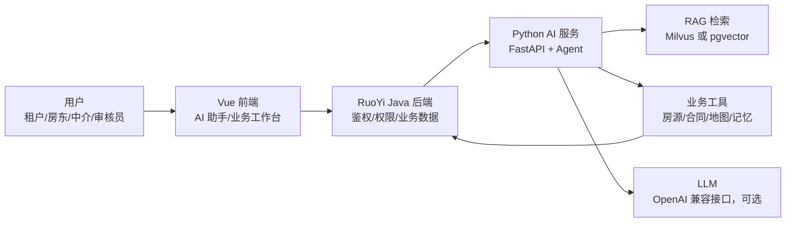
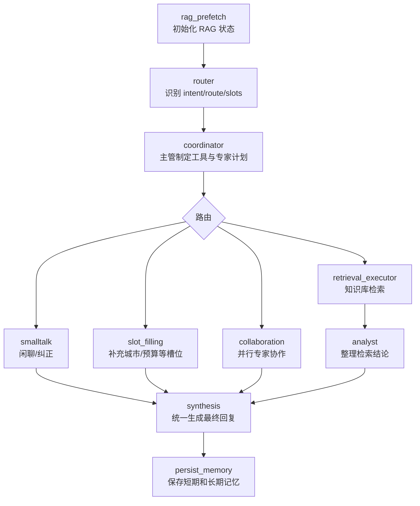
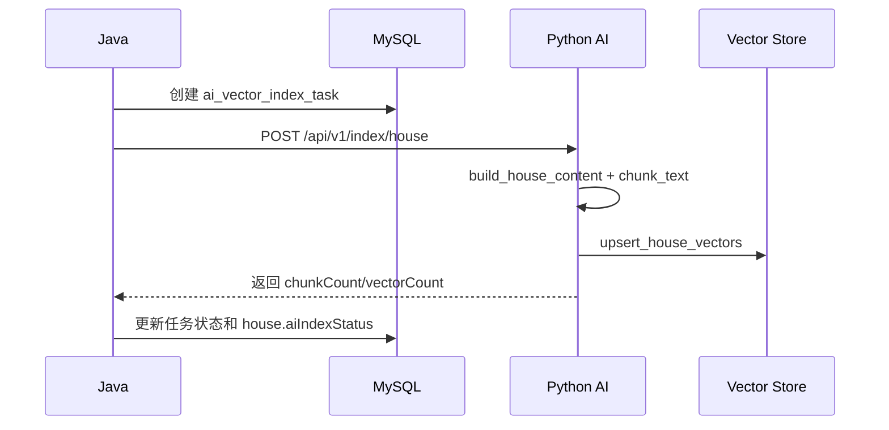

# AI 逻辑与实现说明

本文档说明智能 AI 房屋租赁系统中 AI 模块的业务逻辑、调用链路和核心实现。当前项目采用“Vue 前端 + RuoYi Java 后端 + Python FastAPI AI 服务”的分层设计，Java 负责登录鉴权、业务数据和事务一致性，Python 负责智能体编排、RAG 检索、工具调用、记忆和大模型兜底增强。

## 1. 总体架构



核心原则：

- 前端只调用 Java，不直接调用 Python AI 服务。
- Java 统一做用户身份、角色权限、业务数据读写和索引任务管理。
- Python AI 服务只做智能判断、检索、内容生成和工具编排。
- 所有写业务数据的动作必须回到 Java 工具层执行，AI 不能直接写 MySQL 业务表。
- 大模型未配置时，系统仍可通过规则、工具和本地索引返回可用结果。

## 2. 请求调用链路

### 2.1 前端到 Java

前端 AI 入口位于：

- `RuoYi-Vue3/src/api/portal/ai.js`
- `RuoYi-Vue3/src/views/portal/index.vue`
- `RuoYi-Vue3/src/views/portal/components/FloatingAiAssistant.vue`

主要接口：

```text
POST /rental/ai/chat
POST /rental/ai/recommend
GET  /rental/ai/capabilities
POST /rental/ai/index/tasks
POST /rental/ai/index/knowledge
```

前端发送的核心字段：

```json
{
  "message": "预算 3000，地铁附近，帮我推荐几套房",
  "role": "tenant",
  "sessionId": "session-id",
  "context": {
    "workMode": "tenant",
    "selected": {},
    "filters": {}
  }
}
```

### 2.2 Java 转发到 Python

Java 控制器：

```text
RuoYi-Vue/ruoyi-admin/src/main/java/com/ruoyi/web/controller/rental/RentalAiController.java
```

核心逻辑：

1. 接收前端请求。
2. 通过 `SecurityUtils` 读取当前登录用户。
3. 自动补充 `userId`、`username`、`roles`、`isAdmin`。
4. 转发到 Python AI 服务。
5. 将 Python 结果包装成 `AjaxResult` 返回前端。

示例链路：

```text
Vue
  -> POST /rental/ai/chat
  -> RentalAiController.chat()
  -> enrichRequest()
  -> Python POST /api/v1/agent/chat
  -> 返回 answer / intent / toolCalls / houseIds / nextActions
```

### 2.3 Python AI 入口

Python 主入口：

```text
ai-service/app/main.py
```

主要接口：

```text
GET  /health
GET  /api/v1/agent/capabilities
POST /api/v1/agent/chat
POST /api/v1/agent/recommend
POST /api/v1/index/house
POST /api/v1/index/knowledge
POST /api/v1/index/knowledge/seed
GET  /api/v1/mcp/manifest
```

`/api/v1/agent/chat` 的处理步骤：

1. `build_agent_state()` 组装状态。
2. `detect_intent()` 识别用户意图。
3. `select_skill()` 选择业务 Skill。
4. 租户找房类请求进入 LangGraph 智能体。
5. 非租户或非图模式请求执行本地工具计划。
6. `render_agent_answer()` 生成规则答案。
7. 如配置大模型，则 `refine_with_llm_if_configured()` 优化回答。
8. `update_memory()` 写入短期会话记忆。
9. 返回结构化响应。

## 3. 意图识别逻辑

AI 先判断用户这句话属于什么业务意图。当前支持的主要意图：

| 意图 | 说明 |
| --- | --- |
| `house_recommend` | 找房、推荐房源、预算筛选、地铁通勤 |
| `contract_risk` | 合同、押金、违约、签约风险 |
| `compliance_review` | 房源审核、违规、虚假房源、发布风险 |
| `listing_copy` | 房源标题、卖点、描述文案 |
| `followup_message` | 跟进话术、沟通回复 |
| `knowledge_answer` | 政策、FAQ、平台规则、流程 |
| `transaction_draft` | 业务弹窗表单辅助填写 |
| `record_summary` | 当前业务记录摘要 |
| `index_advice` | AI 索引、知识库、向量状态 |
| `smalltalk` | 问候、普通闲聊 |
| `correction` | 用户纠正上一轮理解 |
| `context_answer` | 兜底上下文问答 |

意图识别有两层：

- 如果配置了 `AI_LLM_BASE_URL`、`AI_LLM_API_KEY`、`AI_LLM_MODEL`，优先让大模型输出结构化 JSON 意图。
- 如果没有配置大模型，则使用关键词规则识别，例如“预算、地铁、找房”进入 `house_recommend`，“合同、押金、违约”进入 `contract_risk`。

## 4. 租户 LangGraph 智能体逻辑

租户找房类请求会优先进入：

```text
ai-service/app/agent/graph.py
```

图流程：



### 4.1 Router

Router 输出：

```json
{
  "intent": "house_recommend",
  "route": "collaboration",
  "slots": {
    "city": "杭州",
    "maxRent": 3000,
    "houseId": null,
    "contractId": null
  },
  "missing_slots": [],
  "confidence": 0.9
}
```

如果找房但缺少城市，会进入 `slot_filling`，先让用户补充城市。

### 4.2 Coordinator

Coordinator 是主管智能体，决定本轮要调用哪些专家和工具。

默认专家：

- `house_search_specialist`：房源检索专家。
- `map_life_specialist`：地图、通勤、周边生活专家。
- `risk_analysis_specialist`：合同与租住风险专家。

找房请求通常并行调用三个专家；合同问题更偏向风险专家；知识库问题走检索执行器。

### 4.3 Collaboration

`collaboration` 使用线程池并行执行专家，合并各专家工具结果，最后由 `synthesis` 统一输出给用户。这样可以避免多个专家分别对用户说话，保证回复口径一致。

### 4.4 Synthesis

`synthesis` 根据意图生成最终回答：

- 找房：汇总房源、通勤和风险建议。
- 合同：突出押金、付款周期、违约责任、维修责任。
- 知识问答：列出命中的知识库片段。
- 槽位缺失：提示用户补充必要字段。

## 5. RAG 检索逻辑

RAG 入口：

```text
ai-service/app/agent/rag/retriever.py
ai-service/app/vector_store.py
```

检索优先级：

1. 如果配置了 `MILVUS_URI` 或 `MILVUS_HOST`，优先查 Milvus。
2. 如果 Milvus 不可用或无命中，则回退到 PostgreSQL + pgvector。
3. 如果远程 Embedding 未配置，则使用本地 hash embedding 兜底。

支持的知识来源：

| 类型 | 内容 |
| --- | --- |
| `house` | 房源文档、标题、描述、标签 |
| `contract` | 合同模板、条款、风险清单 |
| `policy` | 平台政策、审核规则、业务流程 |
| `faq` | 常见问题 |
| `chat` | 业务沟通摘要 |
| `enterprise` | 企业制度、SOP、运营规范 |

知识写入接口：

```text
POST /api/v1/index/knowledge
```

房源写入接口：

```text
POST /api/v1/index/house
```

房源索引流程：



## 6. 工具调用逻辑

工具分两类：Python 本地工具和 Java 业务工具。

### 6.1 Python 本地工具

注册位置：

```text
ai-service/app/tooling.py
ai-service/app/main.py
```

工具通过装饰器注册：

```python
@tool("review_house_compliance")
def review_house_compliance(state, **kwargs):
    ...
```

当前主要工具：

| 工具 | 作用 |
| --- | --- |
| `search_public_houses` | 检索公开房源索引 |
| `search_knowledge_base` | 检索统一知识库 |
| `review_house_compliance` | 房源合规审查 |
| `explain_contract_risk` | 合同风险解释 |
| `draft_listing_copy` | 生成房源文案 |
| `draft_followup_message` | 生成跟进话术 |
| `draft_transaction_form` | 生成业务弹窗字段建议 |
| `summarize_business_record` | 摘要当前业务记录 |
| `summarize_index_state` | 查看索引状态 |

工具执行统一返回：

```json
{
  "name": "search_public_houses",
  "label": "检索房源索引",
  "status": "success",
  "resultSummary": "工具已完成",
  "output": {},
  "startedAt": "2026-06-15T16:00:00"
}
```

### 6.2 Java 业务工具

Python 工具层：

```text
ai-service/app/agent/tools/rental_business.py
```

Java 工具层：

```text
RuoYi-Vue/ruoyi-admin/src/main/java/com/ruoyi/web/controller/rental/RentalAiToolController.java
```

Python 调 Java 的工具包括：

| Python 函数 | Java 路径 | 作用 |
| --- | --- | --- |
| `search_houses` | `/rental/ai/tools/houses/search` | 查询实时房源 |
| `get_house_detail` | `/rental/ai/tools/houses/detail` | 查询房源详情 |
| `get_contract` | `/rental/ai/tools/contracts/detail` | 查询合同详情 |
| `get_house_map_context` | `/rental/ai/tools/amap/house-context` | 查询通勤与周边 |
| `save_long_term_memory` | `/rental/ai/tools/memory/save` | 保存长期记忆 |
| `execute_action` | `/rental/ai/tools/actions/execute` | 执行业务白名单动作 |

如果 Java 工具层未配置，Python 会回退到本地工具或返回友好提示。

## 7. 记忆逻辑

记忆分为短期记忆和长期记忆。

### 7.1 短期记忆

短期记忆保存在 Python 运行时内存：

```text
ai-service/app/runtime_store.py
```

每次对话后写入：

```python
update_memory(session_key, user_message, answer)
```

只保留最近若干轮，用于同一会话的上下文连续性。

### 7.2 长期记忆

租户 LangGraph 在 `persist_memory` 节点中调用：

```python
save_long_term_memory(...)
```

长期记忆通过 Java 工具层保存，适合记录稳定偏好，例如：

- 用户预算上限。
- 是否接受合租。
- 期望地铁附近。
- 是否养宠物。
- 常用通勤目的地。

临时信息不应写长期记忆，例如“今天下午有空”。

## 8. 安全与权限边界

AI 模块的安全边界如下：

1. 用户身份由 Java 读取，不相信前端自行传入的角色。
2. AI 只生成建议，不能绕过 Java 权限直接操作业务表。
3. 房源审核、合同签署、预约创建、下架、成交等高风险动作必须经过 Java 校验。
4. 写操作通过白名单控制，未在白名单内的动作会被拒绝。
5. 高风险动作需要前端或用户二次确认。
6. 工具调用需要记录审计日志，便于追踪 AI 做过什么。
7. RAG 命中的知识只作为上下文，不允许知识内容覆盖系统规则。

动作白名单示例：

```text
create_appointment
favorite_house
create_intention
estimate_monthly_cost
view_contract
```

## 9. 大模型接入逻辑

系统支持 OpenAI 兼容接口。环境变量：

```text
AI_LLM_BASE_URL=https://example.com/v1
AI_LLM_API_KEY=your-api-key
AI_LLM_MODEL=qwen-plus
```

使用位置：

- 意图识别：让模型输出结构化 JSON。
- 主管规划：让模型决定专家和工具计划。
- 回答润色：基于工具结果生成更自然的业务回复。

兜底策略：

- 未配置大模型时，系统使用关键词规则和本地工具。
- 大模型调用失败时，返回规则答案。
- 大模型必须基于工具结果回答，不允许编造房源、合同或用户信息。

## 10. 能力响应格式

AI 最终返回给前端的数据结构：

```json
{
  "answer": "我先按预算、区域、通勤和签约风险一起看...",
  "intent": "house_recommend",
  "intentLabel": "房源推荐",
  "skill": {},
  "houseIds": [101, 205],
  "toolCalls": [],
  "collaboration": {},
  "memoryUpdated": true,
  "suggestions": {},
  "nextActions": ["选中房源", "发起预约", "提交意向"],
  "checkpoints": ["rag_prefetch", "router", "coordinator", "collaboration", "synthesis"],
  "rag": {
    "source": "pgvector",
    "hits": []
  }
}
```

前端可以使用：

- `answer` 展示 AI 回复。
- `houseIds` 拉取或高亮推荐房源。
- `toolCalls` 展示 AI 调用了哪些工具。
- `suggestions` 自动回填审核理由、事务表单等字段。
- `nextActions` 渲染下一步操作按钮。
- `collaboration/checkpoints/rag` 展示智能体执行轨迹。

## 11. 一个完整找房例子

用户输入：

```text
预算 3000，杭州地铁附近，帮我推荐几套一室一厅。
```

执行流程：

1. Vue 调用 `/rental/ai/chat`。
2. Java 补充用户身份和角色后转发 Python。
3. Python 识别为 `house_recommend`。
4. Router 抽取槽位：城市杭州、预算 3000。
5. Coordinator 决定并行调用房源、地图、风险专家。
6. 房源专家调用 Java 实时房源工具或本地索引。
7. 地图专家查询通勤和周边配套。
8. 风险专家生成看房和签约注意事项。
9. Synthesis 合并为一条自然语言回复。
10. Persist memory 保存本轮偏好。
11. 返回推荐房源 ID、工具调用记录和下一步动作。

## 12. 扩展新能力的方法

### 12.1 新增一个 Skill

1. 在 `ai-service/app/skills` 新建 Markdown 文件。
2. 在 `ai-service/app/skill_registry.py` 注册文件。
3. 在意图到 Skill 的映射中加入新意图。

### 12.2 新增一个 Python 工具

1. 在 `ai-service/app/main.py` 或独立工具模块中写函数。
2. 使用 `@tool("tool_name")` 注册。
3. 在 `default_tool_plan()` 或 LangGraph 专家中调用。
4. 在 `tool_label()` 和 `tool_description()` 中补充展示文案。

### 12.3 新增一个 Java 业务工具

1. 在 Java 增加 `/rental/ai/tools/**` 接口。
2. 校验 `X-AI-Tool-Token`、用户、角色和数据权限。
3. Python 在 `rental_business.py` 中封装调用。
4. 写操作加入白名单和确认策略。
5. 记录工具审计日志。

### 12.4 新增一种 RAG 知识

1. 确定 `sourceType`。
2. 调用 `/api/v1/index/knowledge` 写入文档。
3. 在检索路由中为对应 intent 增加 `source_types`。
4. 前端根据需要展示引用片段。

## 13. 关键文件索引

| 文件 | 作用 |
| --- | --- |
| `RuoYi-Vue3/src/api/portal/ai.js` | 前端 AI API |
| `RuoYi-Vue3/src/views/portal/index.vue` | 门户 AI 助手和业务工作台 |
| `RuoYi-Vue/ruoyi-admin/src/main/java/com/ruoyi/web/controller/rental/RentalAiController.java` | Java AI 转发、索引任务 |
| `RuoYi-Vue/ruoyi-admin/src/main/java/com/ruoyi/web/controller/rental/RentalAiToolController.java` | Java 业务工具层 |
| `ai-service/app/main.py` | Python FastAPI 入口、通用 Agent |
| `ai-service/app/agent/graph.py` | 租户 LangGraph 智能体 |
| `ai-service/app/agent/tools/rental_business.py` | Python 调 Java 业务工具 |
| `ai-service/app/agent/rag/retriever.py` | RAG 检索入口 |
| `ai-service/app/vector_store.py` | pgvector/Milvus 兜底索引逻辑 |
| `ai-service/app/tooling.py` | 工具注册和统一调用封装 |
| `ai-service/app/skill_registry.py` | Skill 加载和意图映射 |
| `ai-service/app/langchain_runtime.py` | LangChain 和 LLM 适配 |
