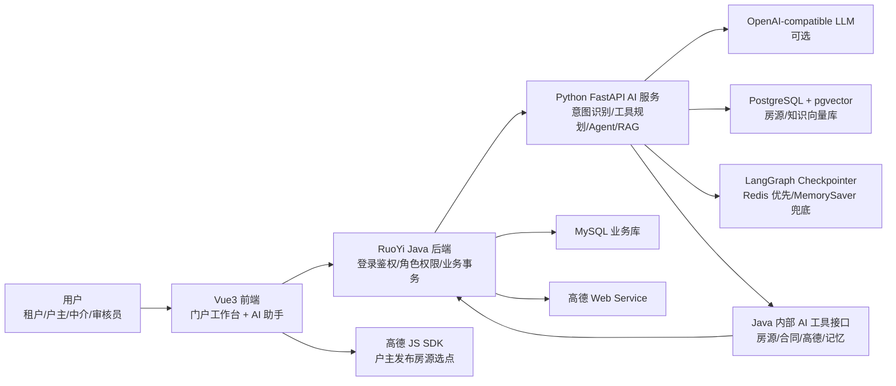
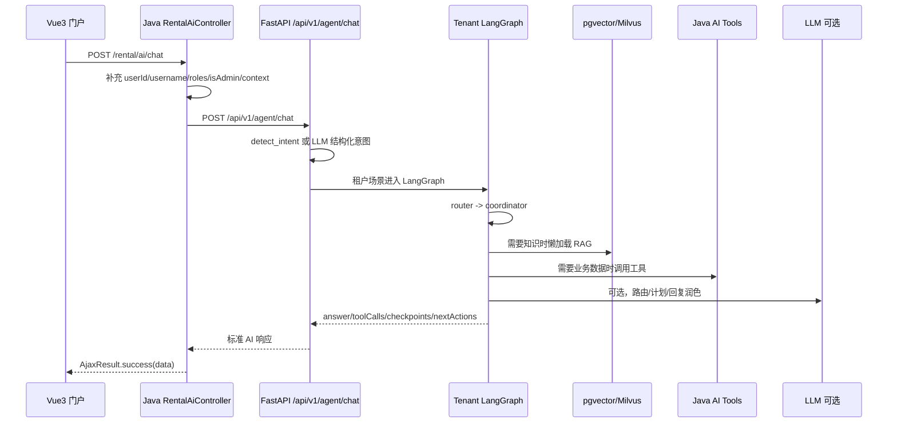
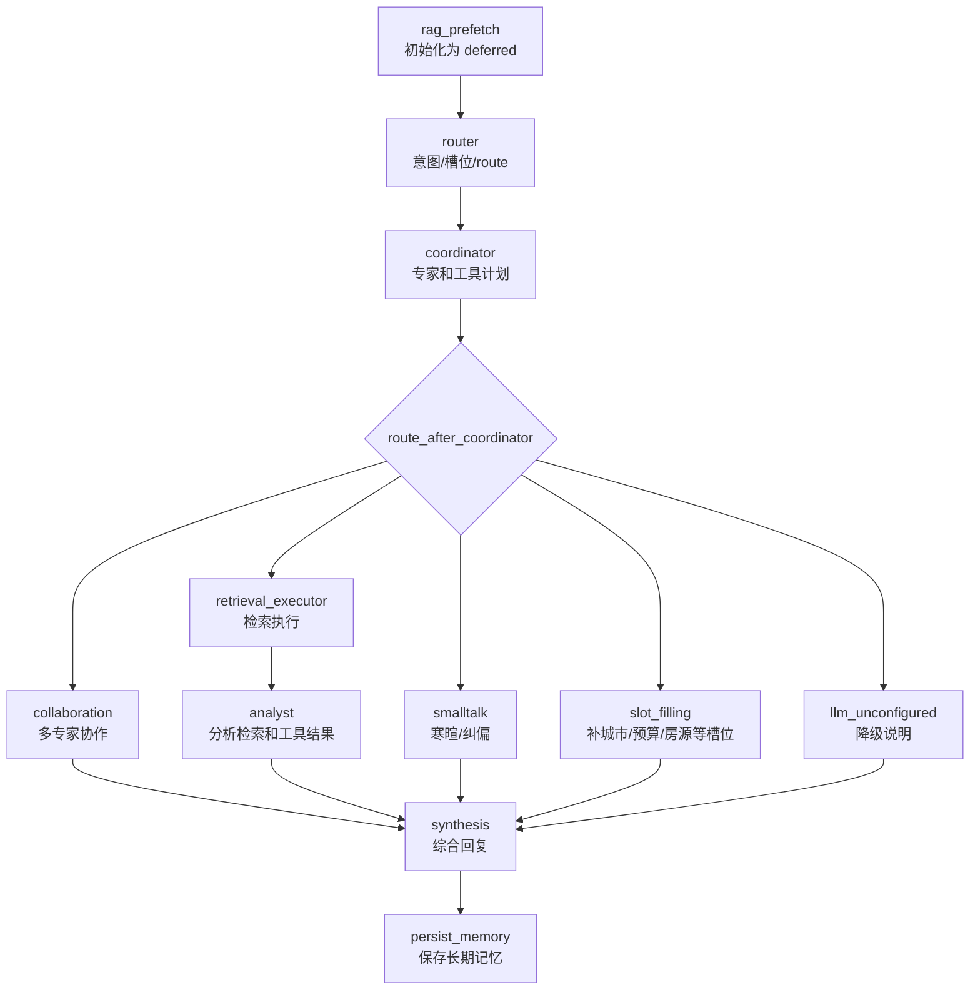

# AI 技术与实现逻辑说明

本文档说明智能房屋租赁系统中 AI 模块的技术选型、调用链路、实现逻辑和后续扩展方式。当前实现以代码为准：前端只访问 Java 后端，Java 负责认证、权限、业务数据和 AI 运维入口，Python FastAPI 负责智能体编排、RAG 检索、工具规划、LangGraph 多轮状态和大模型增强。

## 1. 总体架构



核心边界：

- 前端只调用 Java，不直接访问 Python AI 服务。
- Java 统一做登录态、角色、菜单权限、数据权限、业务事务和 AI 运维权限。
- Python AI 服务只做智能判断、工具编排、RAG 检索、LLM 改写和多轮状态。
- Python 需要业务数据时，必须通过 Java `/rental/ai/tools/**` 内部工具接口读取或写入。
- 大模型和远程 embedding 未配置时，系统仍能通过规则计划、本地工具和本地哈希向量降级运行。

## 2. 关键代码位置

| 模块 | 文件 | 职责 |
| --- | --- | --- |
| 前端 AI API | `RuoYi-Vue3/src/api/portal/ai.js` | 封装门户 AI 聊天、会话、推荐、索引任务接口 |
| 前端门户 | `RuoYi-Vue3/src/views/portal/index.vue` | AI 助手、业务工具、户主房源发布、高德选点入口 |
| 前端高德 SDK | `RuoYi-Vue3/src/utils/amap.js` | 加载高德 JS SDK，判断 `VITE_AMAP_JS_API_KEY` 是否可用 |
| Java AI 网关 | `RuoYi-Vue/ruoyi-admin/src/main/java/com/ruoyi/web/controller/rental/RentalAiController.java` | 前端 AI 请求入口，转发 Python，管理会话和索引任务 |
| Java AI 工具 | `RuoYi-Vue/ruoyi-admin/src/main/java/com/ruoyi/web/controller/rental/RentalAiToolController.java` | Python 调用的内部工具边界，使用 `X-AI-Tool-Token` |
| Java 高德服务 | `RuoYi-Vue/ruoyi-admin/src/main/java/com/ruoyi/web/service/RentalAmapService.java` | 调高德周边、地理编码、路线接口 |
| Python AI 入口 | `ai-service/app/main.py` | FastAPI 接口、意图识别、工具规划、普通 Agent 流程 |
| 租户 LangGraph | `ai-service/app/agent/graph.py` | 租户多智能体图、路由、协作、RAG 懒加载、综合回复 |
| Checkpointer | `ai-service/app/agent/memory/checkpoint.py` | LangGraph checkpoint，Redis 持久化优先，内存兜底 |
| 向量库 | `ai-service/app/vector_store.py` | pgvector 建表、embedding、房源/知识入库和检索 |
| RAG 检索器 | `ai-service/app/agent/rag/retriever.py` | Milvus 可选优先，pgvector 兜底，构造 prompt context |
| Docker 编排 | `docker-compose.yml` | MySQL、Redis、pgvector、AI、后端、前端容器 |

## 3. 端到端请求链路

以租户在门户 AI 助手中发送“预算 3000，地铁附近，帮我推荐房源”为例：



前端发送的典型请求：

```json
{
  "message": "预算 3000，地铁附近，帮我推荐几套房",
  "role": "tenant",
  "sessionId": "user-101",
  "context": {
    "workMode": "tenant",
    "selected": {},
    "filters": {}
  }
}
```

Java 会补充当前登录用户相关字段，例如 `userId`、`username`、`roles`、`isAdmin`，避免前端伪造核心身份。

## 4. 前端实现方式

前端 AI 接口集中在 `RuoYi-Vue3/src/api/portal/ai.js`：

| 方法 | Java 接口 | 说明 |
| --- | --- | --- |
| `sendPortalAiChat` | `POST /rental/ai/chat` | 普通 AI 聊天入口 |
| `sendAiConversationMessage` | `POST /rental/ai/conversations/{id}/messages` | 带会话持久化的聊天入口 |
| `recommendRentalHouses` | `POST /rental/ai/recommend` | 房源推荐入口 |
| `getAiCapabilities` | `GET /rental/ai/capabilities` | 查看 AI 服务能力、向量库、LangChain、checkpointer 状态 |
| `createAiIndexTask` | `POST /rental/ai/index/tasks` | 创建向量索引任务，admin 权限 |
| `indexKnowledgeDocument` | `POST /rental/ai/index/knowledge` | 知识入库，admin 权限 |
| `seedKnowledgeDocuments` | `POST /rental/ai/index/knowledge/seed` | 初始化知识库，admin 权限 |

门户页面 `RuoYi-Vue3/src/views/portal/index.vue` 中有两类 AI 入口：

- 普通用户使用右下角 AI 助手和业务工具卡片。
- 户主发布房源时，通过高德/全球地图选择经纬度，保存到房源数据，再由 AI 索引任务写入向量库。

高德前端 SDK 位于 `RuoYi-Vue3/src/utils/amap.js`，使用：

- `VITE_AMAP_JS_API_KEY`：浏览器端高德 JS Key。
- `VITE_AMAP_SECURITY_JS_CODE`：开启安全密钥时使用。

注意：`VITE_*` 会进入前端构建产物，只能使用受域名限制的浏览器 Key；服务端高德 Key 使用 `AMAP_API_KEY`，不要暴露到前端。

## 5. Java AI 网关

Java 网关入口是 `RentalAiController`，主要职责：

- 校验用户登录态和角色权限。
- 将前端请求 enrich 成 AI 可理解的上下文。
- 转发到 Python AI 服务。
- 管理 AI 会话、消息、上下文和摘要。
- 管理知识库和向量索引任务。
- 对高风险 AI 运维接口使用 admin 权限收口。

主要接口：

| Java 接口 | Python 目标或本地逻辑 | 权限定位 |
| --- | --- | --- |
| `POST /rental/ai/chat` | `/api/v1/agent/chat` | 业务角色可用 |
| `POST /rental/ai/recommend` | `/api/v1/agent/recommend` | 业务角色可用 |
| `GET /rental/ai/capabilities` | `/api/v1/agent/capabilities` | 业务角色可查看 |
| `GET/POST/DELETE /rental/ai/conversations` | Java 会话服务 | 当前用户自己的会话 |
| `POST /rental/ai/index/knowledge` | `/api/v1/index/knowledge` | admin |
| `POST /rental/ai/index/tasks` | Java 创建任务 | admin |
| `POST /rental/ai/index/tasks/{id}/process` | 处理向量任务 | admin |
| `GET /rental/ai/houses/{id}/document` | 查看房源 AI 文档 | admin |

权限最终原则：

- `admin` 管 AI 配置、知识库、向量索引、会话审计、工具日志等 AI 运维能力。
- `auditor` 管业务审核，例如房源审核。
- `auditor` 不默认拥有 `system:doc:*`、`system:chunk:*`、`system:task:*`、`system:memory:*`、`system:session:*`、`system:log:*`。
- 需要兼岗时给用户显式分配双角色，而不是把 AI 运维权限扩散给审核员。

## 6. Java 内部工具边界

Python AI 不直接读写 MySQL 业务表，而是调用 `RentalAiToolController`：

```text
POST /rental/ai/tools/houses/search
POST /rental/ai/tools/houses/detail
POST /rental/ai/tools/amap/house-context
POST /rental/ai/tools/amap/around
POST /rental/ai/tools/contracts/detail
POST /rental/ai/tools/memory/save
```

安全方式：

- 请求头使用 `X-AI-Tool-Token`。
- Java 配置项为 `ai.service.internal-token`，Docker 中通过 `AI_INTERNAL_TOOL_TOKEN` 注入。
- 工具调用写入 `AiToolAuditLog`，便于后续追踪 AI 调用了什么、是否成功、耗时多少。

这样设计的原因：

- 业务数据仍由 Java 服务层控制，复用已有数据权限和业务规则。
- Python 智能体只拿“可给 AI 使用”的结构化结果。
- 高风险写操作可以在 Java 层继续加审批、幂等、审计和角色判断。

## 7. Python AI 服务接口

Python 入口在 `ai-service/app/main.py`。

| 接口 | 说明 |
| --- | --- |
| `GET /health` | 健康检查 |
| `GET /api/v1/agent/capabilities` | 返回 AI 能力、向量库状态、embedding 模式、checkpointer 状态 |
| `POST /api/v1/agent/chat` | 主聊天入口 |
| `POST /api/v1/agent/recommend` | 推荐入口 |
| `POST /api/v1/index/house` | 房源文档入向量库 |
| `POST /api/v1/index/knowledge` | 知识文档入向量库 |
| `POST /api/v1/index/knowledge/seed` | 初始化知识库 |
| `GET /api/v1/mcp/manifest` | MCP 工具/资源清单 |

`/api/v1/agent/capabilities` 是排障最重要的接口，重点看：

- `vectorDbReady`：pgvector 是否可用。
- `embeddingMode`：`remote` 或 `local-hash`。
- `embeddingModel`：远程模型名或 `local-hash`。
- `checkpointer`：LangGraph checkpoint 是否持久化。
- `langchain.available`：LangChain 能否使用。
- `tools`：当前注册的工具清单。
- `multiAgentModes`：租户图和聊天业务智能体状态。

## 8. 意图识别和工具规划

主入口 `chat()` 的逻辑是：

1. `build_agent_state()` 整理 message、role、context、selected、filters、memory。
2. `detect_intent()` 判断意图。
3. 如果是 `chat_assist`，进入业务聊天智能体。
4. 如果是租户找房/问房源/合同风险等场景，进入租户 LangGraph。
5. 否则执行普通工具规划 `run_agent_tools()`。
6. `render_agent_answer()` 汇总工具结果。
7. `refine_with_llm_if_configured()` 在配置 LLM 时做最终润色。
8. `update_memory()` 写入短期记忆。

意图识别方式：

- 配置了 `AI_LLM_BASE_URL`、`AI_LLM_API_KEY`、`AI_LLM_MODEL` 时，优先让模型输出结构化 JSON 意图。
- 未配置或调用失败时，走关键词和上下文规则兜底。

工具规划方式：

- `plan_agent_tools_with_llm()` 让模型先输出 tool plan。
- 模型 plan 只允许选择注册过的工具，避免幻觉工具名。
- `merge_tool_plan()` 会把必要默认工具和模型计划合并。
- 如果模型不可用，`default_tool_plan()` 兜底。
- 最终计划写入 `state["agentPlan"]`，返回给前端和排障使用。

这就是当前“模型自主理解 -> 动态规划分支”的实现：不是完全靠前端按钮或硬编码 if/else，而是 LLM 先决定工具计划，系统再用白名单、默认计划和规则兜底保证稳定性。

## 9. 租户 LangGraph 流程

租户智能体位于 `ai-service/app/agent/graph.py`。当前图结构：



关键点：

- `rag_prefetch` 现在不立即检索，只把 `state["rag"]` 标记为 `{"source": "deferred"}`。
- `coordinator` 判断需要知识时才调用 `ensure_rag_loaded()`。
- `smalltalk`、`correction`、缺槽补问不预检索，避免“你好”也命中一堆业务知识。
- `llm_route_decision()` 可用时由模型决定 intent、route、slots、missing_slots。
- `llm_coordinator_plan()` 可用时由模型决定需要哪些专家。
- 失败时 fallback 到规则路由和规则专家计划。

专家分工：

| 专家 | 触发场景 | 主要能力 |
| --- | --- | --- |
| `house_search_specialist` | 找房、推荐、筛选 | 搜索公开房源、结合预算和城市排序 |
| `map_life_specialist` | 周边、通勤、地图 | 调高德周边/路线工具 |
| `risk_analysis_specialist` | 合同、押金、签约风险 | 调知识库和合同上下文 |

图状态恢复：

- `build_graph()` 已使用 `builder.compile(checkpointer=_CHECKPOINTER)`。
- 每次调用使用 `checkpoint_config(session_id)`，thread_id 来源于会话或用户。
- 服务重启后恢复依赖 Redis checkpointer；Redis 不可用时只保留进程内 MemorySaver。

## 10. RAG 和向量库

向量库实现位于 `ai-service/app/vector_store.py`，当前使用 PostgreSQL + pgvector。

自动创建两张表：

| 表 | 内容 |
| --- | --- |
| `ai_house_chunks` | 房源文档分块、城市、租金、面积、payload、embedding |
| `ai_knowledge_chunks` | 知识文档分块、source_type、source_id、roles、payload、embedding |

知识来源类型：

```text
house, contract, policy, faq, chat, enterprise
```

embedding 逻辑：

- 如果配置 `AI_EMBEDDING_BASE_URL`、`AI_EMBEDDING_API_KEY`、`AI_EMBEDDING_MODEL`，调用 OpenAI-compatible `/embeddings`。
- 如果未配置或调用失败，使用本地哈希向量 `local-hash` 兜底。
- `VECTOR_DB_EMBEDDING_DIM` 必须和实际 embedding 维度一致；远程模型换维度时需要重建或迁移向量表。

知识检索逻辑：

- `search_vector_knowledge()` 支持 `source_types` 过滤。
- 使用 `AI_KNOWLEDGE_MIN_SCORE` 控制最低相似度，默认 `0.12`。
- 检索结果按 `score` 排序，低分内容不会进入 prompt。
- `agent/rag/retriever.py` 中 Milvus 可选优先；未配置 Milvus 或无命中时回退 pgvector。

房源入库流程：

1. 户主创建或更新房源，保存标题、地址、经纬度、图片、租金、面积等业务字段。
2. Java 创建 `AiVectorIndexTask`。
3. 管理员或任务消费者处理索引任务。
4. Java 构造房源 AI 文档并调用 Python `POST /api/v1/index/house`。
5. Python 分块并写入 `ai_house_chunks`。
6. 租户搜索或 AI 问答时通过向量检索命中房源。

知识入库流程：

1. 管理员通过 `/rental/ai/index/knowledge` 提交知识文档。
2. Java 转发 Python `POST /api/v1/index/knowledge`。
3. Python 根据 `sourceType/sourceId/title/content/roles/payload` 分块。
4. 写入 `ai_knowledge_chunks`。
5. Agent 根据意图推断 `source_types`，例如合同风险优先查 `contract/policy/faq`。

## 11. 高德地图接入

高德有两条链路：浏览器选点和服务端 AI 工具。

### 11.1 户主发布房源选点

前端入口：

- `RuoYi-Vue3/src/views/portal/index.vue`
- `RuoYi-Vue3/src/utils/amap.js`

配置：

```text
VITE_AMAP_JS_API_KEY=
VITE_AMAP_SECURITY_JS_CODE=
```

实现方式：

- 户主新建房源时打开位置选择器。
- 如果高德 JS Key 可用，使用高德地图搜索和点选。
- 选点后把 `longitude`、`latitude`、`address` 等字段随房源一起保存。
- 后续房源索引任务会把地址和坐标写进 AI 房源文档，租户前端能看到，AI 也能检索和调用地图上下文。

### 11.2 AI 调高德服务端工具

Java 服务：

- `RentalAmapService`
- 配置项 `amap.api-key`
- 环境变量 `AMAP_API_KEY`

调用的高德 REST 能力：

- `/v5/place/around`：周边 POI。
- `/v3/geocode/geo`：地址转经纬度。
- `/v3/direction/transit/integrated`：公交/地铁通勤。
- `/v3/direction/driving`：驾车路线。
- `/v3/direction/walking`：步行路线。

AI 工具：

- `amap_house_context`：基于房源坐标生成周边和通勤上下文。
- `amap_around`：按坐标、关键词、城市查询周边。

调用链：

```text
Python Agent -> Java /rental/ai/tools/amap/house-context -> RentalAmapService -> 高德 REST API
```

## 12. 记忆和多轮状态

当前有三层记忆：

| 类型 | 位置 | 用途 |
| --- | --- | --- |
| 请求历史 | Java 会话消息 + 请求 `history` | 给当前回答提供最近对话上下文 |
| 短期记忆 | Python `update_memory()` / `merge_memory()` | 控制上下文窗口和摘要 |
| LangGraph checkpoint | RedisBackedMemorySaver 或 MemorySaver | 恢复租户图多轮执行状态 |
| 长期业务记忆 | Java `/rental/ai/tools/memory/save` | 保存用户偏好和可复用事实 |

Checkpointer 默认行为：

- `LANGGRAPH_CHECKPOINT_BACKEND=redis`。
- 如果 `REDIS_URL` 或 `REDIS_HOST/REDIS_PORT/REDIS_PASSWORD` 可用，使用 Redis 持久化。
- Redis key 默认 `langgraph:tenant_agent:checkpoints`。
- `LANGGRAPH_CHECKPOINT_TTL_SECONDS` 可设置过期时间。
- Redis 不可用时回退 `MemorySaver`，只能在当前进程内恢复。

因此，服务重启后还要恢复租户图状态，必须保证 Redis 容器和 `redis-data` 卷正常。

## 13. 大模型和 LangChain 接入

AI 服务兼容 OpenAI 风格接口。

LLM 配置：

```text
AI_LLM_BASE_URL=
AI_LLM_API_KEY=
AI_LLM_MODEL=
```

Embedding 配置：

```text
AI_EMBEDDING_BASE_URL=
AI_EMBEDDING_API_KEY=
AI_EMBEDDING_MODEL=
AI_EMBEDDING_DIM=
VECTOR_DB_EMBEDDING_DIM=
```

当前 LLM 用途：

- 意图识别：`detect_intent_with_llm()`。
- 工具规划：`plan_agent_tools_with_llm()`。
- 租户图路由：`llm_route_decision()`。
- 租户图协调：`llm_coordinator_plan()`。
- 最终回复润色：`refine_with_llm_if_configured()`。

降级策略：

- LLM 未配置：走规则意图、默认工具计划和模板化回复。
- embedding 未配置：走本地哈希向量。
- LangGraph 不可用：走 `FallbackGraph` 顺序执行。
- Redis 不可用：checkpointer 使用内存模式。
- 高德未配置：地图工具返回降级说明，不阻塞主流程。

## 14. 对象存储和图片

图片存储当前预留了本地和腾讯 COS 两种方式。

配置位于 Java `application.yml` 和根目录 `.env.example`：

```text
STORAGE_PROVIDER=local
TENCENT_COS_SECRET_ID=
TENCENT_COS_SECRET_KEY=
TENCENT_COS_REGION=ap-beijing
TENCENT_COS_BUCKET=homeimage-1419823100
TENCENT_COS_PRESIGNED_EXPIRATION_SECONDS=43200
```

实现原则：

- 房源图片由 Java 后端负责上传、保存 URL 或对象 key。
- AI 房源文档只引用图片 URL、封面图和描述，不直接保存二进制图片。
- 私有读桶时，Java 给前端预签名下载链接。
- SecretId 和 SecretKey 只能放本机 `.env` 或服务器环境变量，不要写进 Git 文档、SQL 或前端代码。

## 15. 部署配置

Docker 编排位于 `docker-compose.yml`，包含：

- `mysql`：RuoYi 和租赁业务库。
- `redis`：登录缓存、LangGraph checkpoint 持久化。
- `vector-db`：pgvector 向量库。
- `ai-service`：Python FastAPI。
- `backend`：RuoYi Java 后端。
- `frontend`：Vue3 前端 Nginx。

常用启动命令：

```powershell
docker compose up -d --build
docker compose ps
docker compose logs -f ai-service
docker compose logs -f backend
```

能力检查：

```powershell
Invoke-WebRequest -UseBasicParsing http://127.0.0.1:8000/health
Invoke-WebRequest -UseBasicParsing http://127.0.0.1:8000/api/v1/agent/capabilities
Invoke-WebRequest -UseBasicParsing http://127.0.0.1/captchaImage
```

前端访问：

```text
http://127.0.0.1/portal/index
```

## 16. 新增能力的方法

### 16.1 新增一个 AI 工具

1. 在 `ai-service/app/main.py` 或 `ai-service/app/agent/tools/**` 中实现函数。
2. 用 `@tool("tool_name")` 或 LangChain `StructuredTool` 注册。
3. 在 `tool_label()`、`tool_description()` 或工具 registry 中补说明。
4. 把工具加入 `default_tool_plan()` 或允许 LLM planner 选择。
5. 如果需要业务数据，优先新增 Java `/rental/ai/tools/**` 接口，不要让 Python 直接写业务库。

### 16.2 新增一种知识来源

1. 在 `KNOWLEDGE_SOURCE_TYPES` 中加入新的 `sourceType`。
2. 调整 `infer_knowledge_source_types()` 或租户图 `infer_rag_source_types()`。
3. 通过 `/rental/ai/index/knowledge` 写入文档。
4. 检查 `search_vector_knowledge()` 的 `source_types` 过滤是否命中。
5. 用 `/api/v1/agent/capabilities` 查看 `indexedKnowledge`。

### 16.3 新增一个租户专家

1. 在 `agent/graph.py` 增加专家处理函数。
2. 在 `required_experts_for_state()` 中定义触发条件。
3. 在 `llm_coordinator_plan()` 的 prompt 允许该专家名。
4. 在 `collaboration()` 的 handlers 中注册。
5. 在 `synthesis()` 中合并该专家输出。

### 16.4 新增高风险动作

高风险动作必须满足：

- 前端只展示给有权限角色。
- Java 控制器加 `@PreAuthorize`。
- Java 服务层再次校验数据权限。
- AI 工具接口使用 `X-AI-Tool-Token`。
- 写 `AiToolAuditLog` 或业务审计日志。
- 如果动作会修改业务数据，AI 只能生成 action request，用户确认后 Java 执行。

## 17. 排障指南

### 17.1 前端显示系统接口 502

检查顺序：

1. `docker compose ps` 看 `backend` 和 `ai-service` 是否 healthy。
2. `docker compose logs -f backend` 看 Java 是否能访问 `ai.service.base-url`。
3. `docker compose logs -f ai-service` 看 Python 是否启动成功。
4. 打开 `http://127.0.0.1:8000/health`。
5. 打开 `http://127.0.0.1:8000/api/v1/agent/capabilities`。

### 17.2 AI 命中无关知识

检查：

- `agentPlan.sourceTypes` 是否过宽。
- `search_vector_knowledge()` 是否传入 `source_types`。
- `AI_KNOWLEDGE_MIN_SCORE` 是否过低。
- 用户消息是否被错误识别成 `knowledge_answer` 或 `context_answer`。
- `smalltalk/correction` 是否走了租户图的懒检索，而不是提前 RAG。

### 17.3 “你好”返回业务审核内容

应检查：

- `detect_intent()` 是否识别为 `smalltalk`。
- `graph.py` 中 `rag_prefetch` 是否只是 `deferred`。
- `coordinator` 是否错误调用 `ensure_rag_loaded()`。
- 前端是否带了错误的 `workMode` 或 `selected` 上下文。

### 17.4 服务重启后多轮状态丢失

检查：

- `LANGGRAPH_CHECKPOINT_BACKEND=redis`。
- `REDIS_HOST` 或 `REDIS_URL` 是否可用。
- `docker-compose.yml` 中 `redis-data` 卷是否存在。
- `/api/v1/agent/capabilities` 的 `checkpointer.persistent` 是否为 `true`。

### 17.5 高德地图不可用

前端选点失败：

- 检查 `VITE_AMAP_JS_API_KEY`。
- 检查高德控制台是否限制了正确域名。
- 检查构建后是否重新启动前端容器。

AI 地图工具失败：

- 检查 `AMAP_API_KEY`。
- 检查 Java `RentalAmapService` 日志。
- 检查 Python 工具调用是否走到 `/rental/ai/tools/amap/**`。

### 17.6 embedding 没有真正启用

检查：

- `AI_EMBEDDING_BASE_URL`、`AI_EMBEDDING_API_KEY`、`AI_EMBEDDING_MODEL` 是否都有值。
- `AI_EMBEDDING_DIM` 是否等于 `VECTOR_DB_EMBEDDING_DIM`。
- `/api/v1/agent/capabilities` 中 `embeddingMode` 是否为 `remote`。
- 换 embedding 维度后是否重建 pgvector 表并重新索引。

## 18. 当前实现结论

当前 AI 层不是单一问答接口，而是“Java 业务边界 + Python 智能体编排 + RAG 向量库 + 高德工具 + Redis 图状态”的组合：

- Java 保证权限、数据和事务正确。
- Python 负责理解、计划、检索、组织回答。
- RAG 让 AI 能访问房源、合同、政策、FAQ、聊天和企业知识。
- 高德让房源位置、周边和通勤能力进入业务与 AI。
- Redis checkpointer 让租户 LangGraph 支持服务重启后的多轮图状态恢复。
- admin/auditor 权限分离，降低 AI 运维能力误暴露风险。

后续维护时优先看 `agentPlan`、`toolCalls`、`checkpoints`、`capabilities` 四个输出，它们基本能解释一次 AI 回复为什么这样产生。
