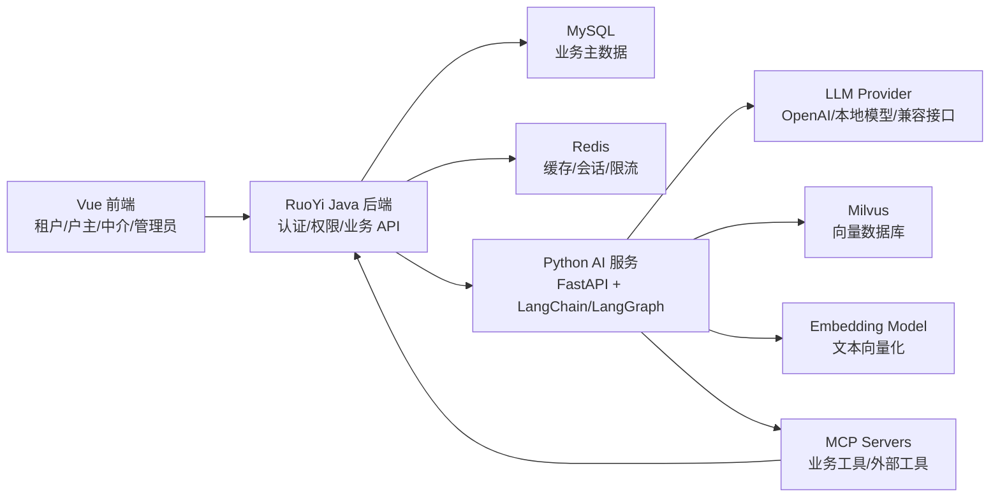
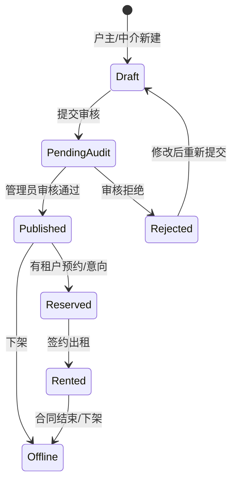
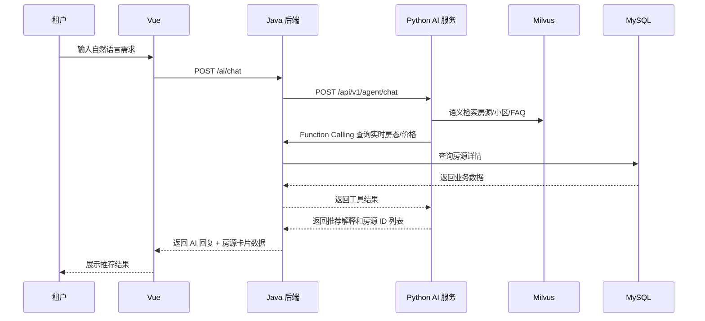
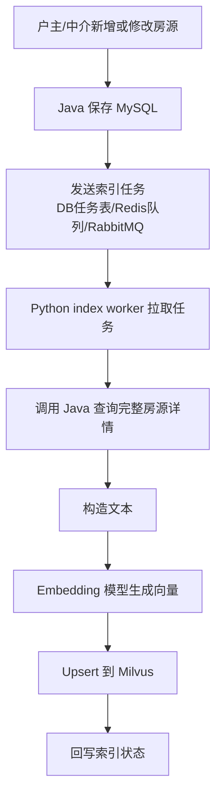
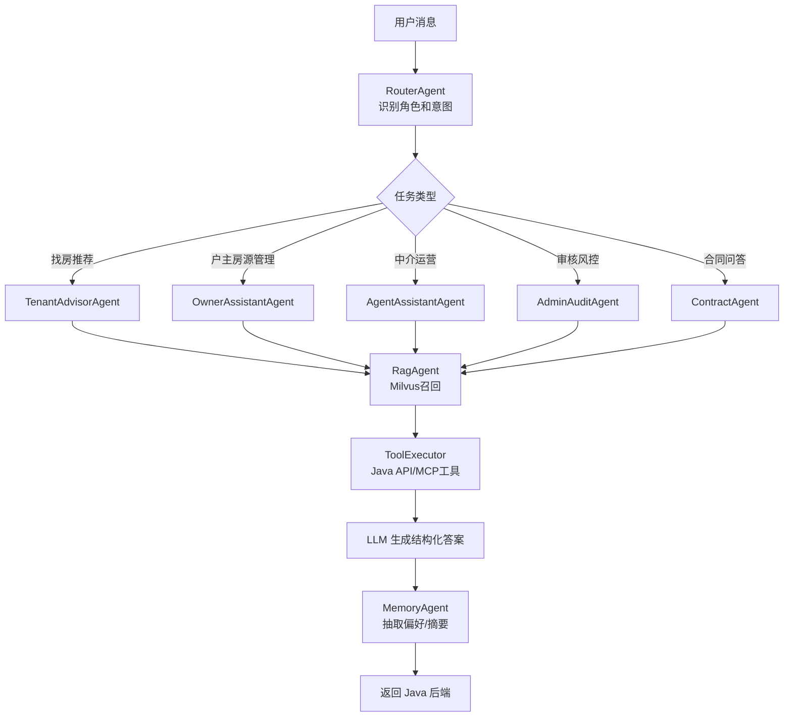

# 智能房屋租赁系统设计文档

> 适用项目：基于当前 RuoYi Java 后端与 Vue 前端扩展，新增 Python AI 服务，使用 LangChain/LangGraph、Milvus、RAG、Memory、MCP、Function Calling 构建智能租赁能力。

## 1. 建设目标

系统定位为“传统房屋租赁业务系统 + 智能租房助手 + 户主资产助手 + 中介运营助手 + 管理员风控助手”。

核心目标：

- 普通租户可以通过自然语言描述需求，获得房源推荐、通勤/预算/户型对比、看房预约、租约问答。
- 户主可以发布自有房源、委托中介运营、查看预约与合同、通过 AI 优化出租策略和收益分析。
- 中介可以发布房源、维护房态、接待客户、让 AI 生成房源文案、匹配潜在租户、跟进意向。
- 管理员可以审核房源、管理用户、查看租赁数据、通过 AI 辅助识别虚假房源/异常行为/敏感内容。
- Java 后端负责用户、权限、业务数据、事务一致性；Python 服务负责 LLM 调用、智能体编排、RAG、向量检索、Memory。
- Milvus 保存房源、社区、合同条款、FAQ、会话摘要等向量数据，用于语义搜索和 RAG。

## 2. 推荐技术架构

### 2.1 总体架构



### 2.2 服务职责边界

Java RuoYi 后端：

- 用户认证、RBAC 权限、菜单权限、数据权限。
- 房源、楼盘、小区、合同、预约、意向、订单等业务 CRUD。
- 所有写业务数据的接口都由 Java 控制事务、权限和审计日志。
- 暴露给 Python 的内部 API，使用服务端 token 或签名鉴权。
- 调用 Python AI 服务，向前端返回智能问答结果、推荐结果、流式响应。

Python AI 服务：

- LangChain/LangGraph 智能体编排。
- 房源 RAG、政策 FAQ RAG、合同条款 RAG。
- 多智能体路由、工具调用、Function Calling。
- Memory 写入和读取。
- Milvus collection 初始化、向量写入、向量检索。
- 可作为 MCP client 调用 MCP server，也可以实现 MCP server 暴露智能检索能力。

Milvus：

- 保存向量化后的房源描述、房源标签、小区配套、合同条款、FAQ、会话摘要。
- 负责语义相似度搜索和元数据过滤。
- 业务主数据仍保存在 MySQL，Milvus 只保存检索需要的文本、向量和必要元数据。

## 3. 角色与权限

### 3.1 普通租户

主要能力：

- 注册登录、维护租房偏好。
- 浏览/搜索/收藏/对比房源。
- AI 自然语言找房。
- 发起看房预约、咨询中介。
- 查看预约状态、租赁意向、合同信息。
- 与 AI 助手多轮对话，保存偏好 Memory。

典型问题：

- “预算 3000，离软件园 30 分钟以内，一室一厅，有地铁，推荐几个。”
- “这三套房哪个更适合情侣住？”
- “帮我约明天下午看第一套。”

### 3.2 户主

主要能力：

- 注册登录、维护户主资料和收款信息。
- 发布/编辑/下架自己的房源。
- 选择“自主出租”或“委托中介运营”。
- 查看自己房源的浏览、收藏、预约、意向和合同。
- 处理租户咨询、确认看房预约。
- 使用 AI 优化租金定价、房源标题、描述、出租策略。
- 查看 AI 生成的房源风险提示和收益分析。

典型问题：

- “我这套两居室租 4200 合理吗？”
- “帮我把这套房描述写得更适合家庭租客。”
- “最近有哪些租户对我的房源感兴趣？”

### 3.3 中介

主要能力：

- 发布/编辑/上下架房源。
- 接受户主委托，代运营房源。
- 维护房源图片、租金、配套、看房时间。
- 查看租户意向与预约。
- 使用 AI 生成房源标题、卖点、短视频口播文案。
- AI 匹配潜在租户。
- 查看跟进记录和客户画像摘要。

典型问题：

- “帮这套房生成吸引年轻白领的标题和描述。”
- “最近有哪些用户适合这套两居室？”
- “总结一下张三最近的租房偏好。”

### 3.4 管理员

主要能力：

- 系统用户/角色/菜单管理。
- 房源审核、违规内容处理。
- 户主身份审核、中介资质审核、委托关系审核。
- 平台数据统计。
- AI 风险识别：虚假房源、重复房源、敏感词、异常价格、违规话术。
- 管理知识库、FAQ、合同模板。

典型问题：

- “列出最近 7 天可能虚假房源。”
- “这个合同模板有什么风险条款？”
- “统计本月各区域平均租金变化。”

## 4. 核心业务模块

### 4.1 房源模块

房源生命周期：



关键规则：

- 户主只能维护自己名下房源，或授权中介代运营。
- 中介只能维护自己发布或被户主授权委托的房源。
- 管理员可以审核和管理全部房源。
- 租户只能看到 `Published` 状态的房源。
- 房源发布/修改后触发向量重建任务，将房源文本写入 Milvus。

### 4.2 租户找房流程



### 4.3 看房预约流程

关键规则：

- 租户通过页面或 AI 发起预约。
- AI 只能“建议”和“发起预约请求”，实际创建预约必须调用 Java 后端工具接口。
- Java 校验房源状态、租户身份、户主/中介可用时间、防重复预约。
- 创建成功后写入预约表、操作日志，通知户主或受托中介。

### 4.4 合同与租赁流程

建议第一阶段只做“合同模板 + 合同草稿 + AI 条款解释”，不要让 AI 自动完成法律确认。

流程：

1. 户主或受托中介选择租户、房源、租期、租金、押金。
2. Java 生成合同草稿。
3. AI 合同助手解释条款、标记风险点、生成摘要。
4. 双方确认后进入待签约状态。
5. 签约结果由人工或电子签平台回调确认。

## 5. Java 与 Python 对接方案

### 5.1 推荐方式

推荐采用 HTTP REST + JSON，Python 使用 FastAPI，Java 使用 Spring `RestTemplate` 或 `WebClient` 调用。

原因：

- RuoYi 是典型 Spring Boot 架构，接 REST 最自然。
- Python AI 服务可能需要独立部署、扩缩容、安装模型依赖。
- AI 服务响应可能较慢，独立服务更方便隔离故障。
- 后续可升级为 SSE/WebSocket 流式输出。

### 5.2 调用方向

Java 调 Python：

- 前端发起 AI 对话、推荐、总结、审核请求。
- Java 验证用户身份和权限后，将 `userId`、`role`、`tenantId`、业务参数传给 Python。
- Python 返回模型结果、工具调用结果、推荐房源 ID。

Python 调 Java：

- Python 智能体需要实时业务数据时，通过 Function Calling 工具调用 Java 内部 API。
- 例如查询房源详情、创建预约、保存偏好、查询户主/中介排班。
- 所有写操作必须让 Java 再做权限校验和业务校验。

### 5.3 Java 调 Python API 设计

Python FastAPI 建议接口：

```text
POST /api/v1/agent/chat
POST /api/v1/agent/recommend
POST /api/v1/agent/listing-copywrite
POST /api/v1/agent/listing-risk-check
POST /api/v1/rag/index/listing
POST /api/v1/rag/delete/listing
POST /api/v1/memory/save
GET  /api/v1/health
```

聊天请求：

```json
{
  "requestId": "uuid",
  "userId": 1001,
  "role": "tenant",
  "sessionId": "chat-session-id",
  "message": "预算3000，地铁附近，一室一厅",
  "context": {
    "city": "杭州",
    "currentPage": "house_search"
  }
}
```

聊天响应：

```json
{
  "requestId": "uuid",
  "answer": "我帮你筛了 5 套更匹配的房源...",
  "intent": "house_recommend",
  "houseIds": [101, 205, 309],
  "toolCalls": [
    {
      "name": "search_houses",
      "status": "success"
    }
  ],
  "memoryUpdated": true,
  "citations": [
    {
      "sourceType": "house",
      "sourceId": 101,
      "text": "近地铁，独立阳台..."
    }
  ]
}
```

### 5.4 Python 调 Java 内部 API 设计

Java 内部 AI 工具 API 建议统一前缀：

```text
/internal/ai/houses/search
/internal/ai/houses/{houseId}
/internal/ai/owners/{ownerId}/houses
/internal/ai/houses/{houseId}/entrust
/internal/ai/entrust/create
/internal/ai/entrust/confirm
/internal/ai/appointments/create
/internal/ai/users/{userId}/preference
/internal/ai/users/{userId}/memory
/internal/ai/contracts/{contractId}
/internal/ai/statistics/rent
```

内部调用鉴权：

- Header: `X-AI-Service-Token`
- Header: `X-Request-Id`
- Header: `X-User-Id`
- Header: `X-User-Role`
- Java 侧校验 token、IP 白名单、限流、审计日志。

Python tool 示例：

```python
from langchain.tools import tool
import httpx

JAVA_BASE_URL = "http://localhost:8080"
AI_SERVICE_TOKEN = "replace-with-env"

@tool
def search_houses(city: str, district: str | None, max_rent: int | None, tags: list[str]) -> dict:
    """Search real-time available houses from Java business system."""
    payload = {
        "city": city,
        "district": district,
        "maxRent": max_rent,
        "tags": tags
    }
    headers = {"X-AI-Service-Token": AI_SERVICE_TOKEN}
    with httpx.Client(timeout=10) as client:
        resp = client.post(f"{JAVA_BASE_URL}/internal/ai/houses/search", json=payload, headers=headers)
        resp.raise_for_status()
        return resp.json()
```

Java Controller 示例：

```java
@RestController
@RequestMapping("/internal/ai/houses")
public class AiHouseInternalController {

    @PostMapping("/search")
    public AjaxResult search(@RequestBody AiHouseSearchRequest request,
                             @RequestHeader("X-AI-Service-Token") String token) {
        // 1. 校验 token
        // 2. 校验查询范围和参数
        // 3. 查询 Published 且未出租房源
        // 4. 返回结构化结果
        return AjaxResult.success(houseService.searchForAi(request));
    }
}
```

## 6. Milvus 向量数据库设计

### 6.1 使用原则

Milvus 用于“语义检索”，MySQL 用于“业务事实”。

建议：

- MySQL 保存完整房源、预约、合同等主数据。
- Milvus 保存可被语义搜索的文本片段、向量、业务 ID、类型、城市、区域、价格等过滤字段。
- AI 推荐时先用 Milvus 做语义召回，再回 MySQL 查实时状态、价格、权限、上下架状态。
- 房源变更后异步更新 Milvus，不要在业务事务里阻塞等待向量化完成。

### 6.2 Collection 设计

#### house_listing_vectors

用途：房源语义检索。

字段建议：

| 字段 | 类型 | 说明 |
| --- | --- | --- |
| id | INT64 | Milvus 主键，可用 house_id 或自增 |
| vector | FLOAT_VECTOR | 房源文本 embedding |
| house_id | INT64 | MySQL 房源 ID |
| city | VARCHAR | 城市 |
| district | VARCHAR | 区域 |
| rent | INT64 | 月租金 |
| room_type | VARCHAR | 户型 |
| status | VARCHAR | published/rented/offline |
| owner_id | INT64 | 户主用户 ID |
| agent_id | INT64 | 中介 ID |
| operation_mode | VARCHAR | self/entrusted |
| text | VARCHAR | 向量化原文 |
| tags | ARRAY/VARCHAR | 标签，可用逗号字符串简化 |
| updated_at | VARCHAR | 更新时间 |

向量文本建议拼接：

```text
标题：滨江区地铁口一室一厅
区域：杭州 滨江区 长河
租金：2800
户型：一室一厅
面积：45平
标签：近地铁、可短租、独立阳台、民用水电
描述：...
配套：...
周边：...
```

#### knowledge_vectors

用途：FAQ、租赁政策、平台规则、合同条款 RAG。

字段建议：

| 字段 | 类型 | 说明 |
| --- | --- | --- |
| id | INT64 | 主键 |
| vector | FLOAT_VECTOR | 文本 embedding |
| doc_id | INT64 | 知识文档 ID |
| chunk_id | VARCHAR | 分片 ID |
| category | VARCHAR | faq/policy/contract/platform_rule |
| title | VARCHAR | 标题 |
| text | VARCHAR | 分片内容 |
| version | VARCHAR | 文档版本 |
| enabled | BOOL | 是否启用 |

#### user_memory_vectors

用途：长期记忆和偏好召回。

字段建议：

| 字段 | 类型 | 说明 |
| --- | --- | --- |
| id | INT64 | 主键 |
| vector | FLOAT_VECTOR | 记忆文本 embedding |
| user_id | INT64 | 用户 ID |
| role | VARCHAR | tenant/agent/admin |
| memory_type | VARCHAR | preference/fact/summary |
| text | VARCHAR | 记忆文本 |
| importance | FLOAT | 重要度 |
| created_at | VARCHAR | 创建时间 |
| expires_at | VARCHAR | 过期时间，可为空 |

### 6.3 Python 初始化 Milvus 示例

开发环境可以使用 Milvus Lite；生产建议 Docker/Kubernetes 部署 Milvus Standalone 或 Distributed。

```python
from pymilvus import MilvusClient, DataType

client = MilvusClient(uri="http://localhost:19530", token="root:Milvus")

def create_house_collection():
    collection_name = "house_listing_vectors"
    if client.has_collection(collection_name):
        return

    schema = client.create_schema(auto_id=False, enable_dynamic_field=True)
    schema.add_field("id", DataType.INT64, is_primary=True)
    schema.add_field("vector", DataType.FLOAT_VECTOR, dim=768)
    schema.add_field("house_id", DataType.INT64)
    schema.add_field("city", DataType.VARCHAR, max_length=64)
    schema.add_field("district", DataType.VARCHAR, max_length=64)
    schema.add_field("rent", DataType.INT64)
    schema.add_field("room_type", DataType.VARCHAR, max_length=64)
    schema.add_field("status", DataType.VARCHAR, max_length=32)
    schema.add_field("owner_id", DataType.INT64)
    schema.add_field("agent_id", DataType.INT64)
    schema.add_field("operation_mode", DataType.VARCHAR, max_length=32)
    schema.add_field("text", DataType.VARCHAR, max_length=4096)

    index_params = client.prepare_index_params()
    index_params.add_index(
        field_name="vector",
        index_type="HNSW",
        metric_type="COSINE",
        params={"M": 16, "efConstruction": 200}
    )
    index_params.add_index(field_name="city")
    index_params.add_index(field_name="district")
    index_params.add_index(field_name="rent")

    client.create_collection(
        collection_name=collection_name,
        schema=schema,
        index_params=index_params
    )
```

### 6.4 房源写入 Milvus 示例

```python
def build_house_text(house: dict) -> str:
    return "\n".join([
        f"标题：{house.get('title', '')}",
        f"城市：{house.get('city', '')}",
        f"区域：{house.get('district', '')}",
        f"地址：{house.get('address', '')}",
        f"租金：{house.get('rent', '')}",
        f"户型：{house.get('roomType', '')}",
        f"面积：{house.get('area', '')}",
        f"标签：{','.join(house.get('tags', []))}",
        f"描述：{house.get('description', '')}",
        f"配套：{house.get('facilities', '')}",
        f"周边：{house.get('surrounding', '')}"
    ])

def upsert_house_vector(house: dict, embedding_fn):
    text = build_house_text(house)
    vector = embedding_fn.embed_query(text)
    data = [{
        "id": int(house["houseId"]),
        "vector": vector,
        "house_id": int(house["houseId"]),
        "city": house["city"],
        "district": house["district"],
        "rent": int(house["rent"]),
        "room_type": house["roomType"],
        "status": house["status"],
        "owner_id": int(house["ownerId"]),
        "agent_id": int(house["agentId"]),
        "operation_mode": house["operationMode"],
        "text": text
    }]
    client.upsert(collection_name="house_listing_vectors", data=data)
```

### 6.5 房源语义检索示例

```python
def semantic_search_houses(query: str, city: str, max_rent: int | None, embedding_fn):
    query_vector = embedding_fn.embed_query(query)
    filters = [f'city == "{city}"', 'status == "published"']
    if max_rent is not None:
        filters.append(f"rent <= {max_rent}")

    result = client.search(
        collection_name="house_listing_vectors",
        data=[query_vector],
        filter=" and ".join(filters),
        limit=20,
        output_fields=["house_id", "city", "district", "rent", "room_type", "text"]
    )
    return result[0]
```

### 6.6 向量同步流程



第一版可以不用消息队列，做一个 `ai_index_task` 表，Python 定时扫描 `pending` 任务即可。

## 7. MySQL 建表语句

以下 SQL 以 MySQL 8 为参考，字段可根据 RuoYi 代码生成器规范继续补充 `create_by`、`create_time`、`update_by`、`update_time`、`remark`。

### 7.1 房源表

```sql
CREATE TABLE rental_house (
  house_id BIGINT NOT NULL AUTO_INCREMENT COMMENT '房源ID',
  owner_id BIGINT NOT NULL COMMENT '户主用户ID',
  agent_id BIGINT DEFAULT NULL COMMENT '中介用户ID，自主出租时为空',
  operation_mode CHAR(1) DEFAULT '0' COMMENT '运营方式:0户主自主出租,1委托中介',
  title VARCHAR(120) NOT NULL COMMENT '房源标题',
  city VARCHAR(64) NOT NULL COMMENT '城市',
  district VARCHAR(64) NOT NULL COMMENT '区域',
  street VARCHAR(128) DEFAULT NULL COMMENT '街道',
  community VARCHAR(128) DEFAULT NULL COMMENT '小区',
  address VARCHAR(255) DEFAULT NULL COMMENT '详细地址',
  longitude DECIMAL(10, 6) DEFAULT NULL COMMENT '经度',
  latitude DECIMAL(10, 6) DEFAULT NULL COMMENT '纬度',
  rent_amount DECIMAL(10, 2) NOT NULL COMMENT '月租金',
  deposit_amount DECIMAL(10, 2) DEFAULT NULL COMMENT '押金',
  area DECIMAL(8, 2) DEFAULT NULL COMMENT '面积',
  room_count INT DEFAULT NULL COMMENT '室',
  hall_count INT DEFAULT NULL COMMENT '厅',
  toilet_count INT DEFAULT NULL COMMENT '卫',
  floor_no INT DEFAULT NULL COMMENT '所在楼层',
  total_floor INT DEFAULT NULL COMMENT '总楼层',
  orientation VARCHAR(32) DEFAULT NULL COMMENT '朝向',
  rent_type CHAR(1) DEFAULT '0' COMMENT '出租方式:0整租,1合租',
  decoration VARCHAR(32) DEFAULT NULL COMMENT '装修',
  facilities VARCHAR(1000) DEFAULT NULL COMMENT '配套设施JSON或逗号分隔',
  tags VARCHAR(500) DEFAULT NULL COMMENT '标签',
  description TEXT COMMENT '房源描述',
  status CHAR(1) NOT NULL DEFAULT '0' COMMENT '状态:0草稿,1待审核,2已发布,3驳回,4已出租,5下架',
  audit_status CHAR(1) DEFAULT '0' COMMENT '审核状态:0未提交,1待审,2通过,3拒绝',
  audit_reason VARCHAR(500) DEFAULT NULL COMMENT '审核意见',
  view_count INT DEFAULT 0 COMMENT '浏览次数',
  favorite_count INT DEFAULT 0 COMMENT '收藏次数',
  ai_index_status CHAR(1) DEFAULT '0' COMMENT '向量索引状态:0未索引,1已索引,2失败',
  del_flag CHAR(1) DEFAULT '0' COMMENT '删除标志',
  create_by VARCHAR(64) DEFAULT '',
  create_time DATETIME DEFAULT CURRENT_TIMESTAMP,
  update_by VARCHAR(64) DEFAULT '',
  update_time DATETIME DEFAULT CURRENT_TIMESTAMP ON UPDATE CURRENT_TIMESTAMP,
  remark VARCHAR(500) DEFAULT NULL,
  PRIMARY KEY (house_id),
  KEY idx_owner_id (owner_id),
  KEY idx_agent_id (agent_id),
  KEY idx_operation_mode (operation_mode),
  KEY idx_city_district (city, district),
  KEY idx_rent_amount (rent_amount),
  KEY idx_status (status)
) ENGINE=InnoDB DEFAULT CHARSET=utf8mb4 COMMENT='租赁房源表';
```

### 7.1.1 户主资料表

```sql
CREATE TABLE rental_owner_profile (
  owner_id BIGINT NOT NULL COMMENT '户主用户ID，对应sys_user.user_id',
  real_name VARCHAR(64) DEFAULT NULL COMMENT '真实姓名',
  id_card_no VARCHAR(64) DEFAULT NULL COMMENT '证件号，可加密存储',
  contact_phone VARCHAR(32) DEFAULT NULL COMMENT '联系电话',
  bank_account VARCHAR(128) DEFAULT NULL COMMENT '收款账户，可加密存储',
  verify_status CHAR(1) DEFAULT '0' COMMENT '认证状态:0未认证,1待审核,2已认证,3拒绝',
  verify_reason VARCHAR(500) DEFAULT NULL COMMENT '审核意见',
  create_time DATETIME DEFAULT CURRENT_TIMESTAMP,
  update_time DATETIME DEFAULT CURRENT_TIMESTAMP ON UPDATE CURRENT_TIMESTAMP,
  PRIMARY KEY (owner_id),
  KEY idx_verify_status (verify_status)
) ENGINE=InnoDB DEFAULT CHARSET=utf8mb4 COMMENT='户主资料表';
```

### 7.1.2 房源委托关系表

```sql
CREATE TABLE rental_house_entrust (
  entrust_id BIGINT NOT NULL AUTO_INCREMENT COMMENT '委托ID',
  house_id BIGINT NOT NULL COMMENT '房源ID',
  owner_id BIGINT NOT NULL COMMENT '户主用户ID',
  agent_id BIGINT NOT NULL COMMENT '中介用户ID',
  entrust_scope VARCHAR(500) DEFAULT NULL COMMENT '委托范围:发布,预约,带看,签约等',
  commission_rate DECIMAL(5, 2) DEFAULT NULL COMMENT '佣金比例',
  start_date DATE DEFAULT NULL COMMENT '委托开始日期',
  end_date DATE DEFAULT NULL COMMENT '委托结束日期',
  status CHAR(1) DEFAULT '0' COMMENT '状态:0待确认,1生效中,2已拒绝,3已终止,4已过期',
  create_time DATETIME DEFAULT CURRENT_TIMESTAMP,
  update_time DATETIME DEFAULT CURRENT_TIMESTAMP ON UPDATE CURRENT_TIMESTAMP,
  PRIMARY KEY (entrust_id),
  KEY idx_house_id (house_id),
  KEY idx_owner_id (owner_id),
  KEY idx_agent_id (agent_id),
  KEY idx_status (status)
) ENGINE=InnoDB DEFAULT CHARSET=utf8mb4 COMMENT='房源委托关系表';
```

### 7.2 房源图片表

```sql
CREATE TABLE rental_house_image (
  image_id BIGINT NOT NULL AUTO_INCREMENT COMMENT '图片ID',
  house_id BIGINT NOT NULL COMMENT '房源ID',
  image_url VARCHAR(500) NOT NULL COMMENT '图片地址',
  image_type CHAR(1) DEFAULT '0' COMMENT '类型:0普通,1封面,2户型图',
  sort_no INT DEFAULT 0 COMMENT '排序',
  create_time DATETIME DEFAULT CURRENT_TIMESTAMP,
  PRIMARY KEY (image_id),
  KEY idx_house_id (house_id)
) ENGINE=InnoDB DEFAULT CHARSET=utf8mb4 COMMENT='房源图片表';
```

### 7.3 租户偏好表

```sql
CREATE TABLE rental_tenant_preference (
  preference_id BIGINT NOT NULL AUTO_INCREMENT COMMENT '偏好ID',
  user_id BIGINT NOT NULL COMMENT '租户用户ID',
  city VARCHAR(64) DEFAULT NULL COMMENT '意向城市',
  districts VARCHAR(500) DEFAULT NULL COMMENT '意向区域',
  min_rent DECIMAL(10, 2) DEFAULT NULL COMMENT '最低预算',
  max_rent DECIMAL(10, 2) DEFAULT NULL COMMENT '最高预算',
  room_type VARCHAR(64) DEFAULT NULL COMMENT '户型偏好',
  commute_target VARCHAR(255) DEFAULT NULL COMMENT '通勤目标',
  commute_minutes INT DEFAULT NULL COMMENT '期望通勤分钟',
  required_tags VARCHAR(500) DEFAULT NULL COMMENT '必须标签',
  preferred_tags VARCHAR(500) DEFAULT NULL COMMENT '偏好标签',
  avoid_tags VARCHAR(500) DEFAULT NULL COMMENT '避雷标签',
  source CHAR(1) DEFAULT '0' COMMENT '来源:0用户填写,1AI提取',
  create_time DATETIME DEFAULT CURRENT_TIMESTAMP,
  update_time DATETIME DEFAULT CURRENT_TIMESTAMP ON UPDATE CURRENT_TIMESTAMP,
  PRIMARY KEY (preference_id),
  UNIQUE KEY uk_user_id (user_id)
) ENGINE=InnoDB DEFAULT CHARSET=utf8mb4 COMMENT='租户租房偏好表';
```

### 7.4 收藏与对比表

```sql
CREATE TABLE rental_house_favorite (
  favorite_id BIGINT NOT NULL AUTO_INCREMENT COMMENT '收藏ID',
  user_id BIGINT NOT NULL COMMENT '用户ID',
  house_id BIGINT NOT NULL COMMENT '房源ID',
  create_time DATETIME DEFAULT CURRENT_TIMESTAMP,
  PRIMARY KEY (favorite_id),
  UNIQUE KEY uk_user_house (user_id, house_id),
  KEY idx_house_id (house_id)
) ENGINE=InnoDB DEFAULT CHARSET=utf8mb4 COMMENT='房源收藏表';
```

### 7.5 预约看房表

```sql
CREATE TABLE rental_appointment (
  appointment_id BIGINT NOT NULL AUTO_INCREMENT COMMENT '预约ID',
  house_id BIGINT NOT NULL COMMENT '房源ID',
  tenant_id BIGINT NOT NULL COMMENT '租户用户ID',
  owner_id BIGINT NOT NULL COMMENT '户主用户ID',
  agent_id BIGINT DEFAULT NULL COMMENT '中介用户ID，自主出租时为空',
  appointment_time DATETIME NOT NULL COMMENT '预约时间',
  contact_name VARCHAR(64) DEFAULT NULL COMMENT '联系人',
  contact_phone VARCHAR(32) DEFAULT NULL COMMENT '联系电话',
  message VARCHAR(500) DEFAULT NULL COMMENT '留言',
  status CHAR(1) DEFAULT '0' COMMENT '状态:0待确认,1已确认,2已完成,3已取消,4已拒绝',
  cancel_reason VARCHAR(500) DEFAULT NULL COMMENT '取消/拒绝原因',
  source CHAR(1) DEFAULT '0' COMMENT '来源:0手动,1AI助手',
  create_time DATETIME DEFAULT CURRENT_TIMESTAMP,
  update_time DATETIME DEFAULT CURRENT_TIMESTAMP ON UPDATE CURRENT_TIMESTAMP,
  PRIMARY KEY (appointment_id),
  KEY idx_house_id (house_id),
  KEY idx_tenant_id (tenant_id),
  KEY idx_owner_id (owner_id),
  KEY idx_agent_id (agent_id),
  KEY idx_appointment_time (appointment_time)
) ENGINE=InnoDB DEFAULT CHARSET=utf8mb4 COMMENT='看房预约表';
```

### 7.6 租赁意向表

```sql
CREATE TABLE rental_intention (
  intention_id BIGINT NOT NULL AUTO_INCREMENT COMMENT '意向ID',
  house_id BIGINT NOT NULL COMMENT '房源ID',
  tenant_id BIGINT NOT NULL COMMENT '租户用户ID',
  owner_id BIGINT NOT NULL COMMENT '户主用户ID',
  agent_id BIGINT DEFAULT NULL COMMENT '中介用户ID，自主出租时为空',
  intention_level CHAR(1) DEFAULT '1' COMMENT '意向等级:1低,2中,3高',
  status CHAR(1) DEFAULT '0' COMMENT '状态:0跟进中,1已成交,2无效,3放弃',
  budget_amount DECIMAL(10, 2) DEFAULT NULL COMMENT '预算',
  expected_move_in DATE DEFAULT NULL COMMENT '期望入住时间',
  note VARCHAR(1000) DEFAULT NULL COMMENT '备注',
  ai_summary VARCHAR(1000) DEFAULT NULL COMMENT 'AI意向摘要',
  create_time DATETIME DEFAULT CURRENT_TIMESTAMP,
  update_time DATETIME DEFAULT CURRENT_TIMESTAMP ON UPDATE CURRENT_TIMESTAMP,
  PRIMARY KEY (intention_id),
  KEY idx_house_id (house_id),
  KEY idx_tenant_id (tenant_id),
  KEY idx_owner_id (owner_id),
  KEY idx_agent_id (agent_id)
) ENGINE=InnoDB DEFAULT CHARSET=utf8mb4 COMMENT='租赁意向表';
```

### 7.7 合同表

```sql
CREATE TABLE rental_contract (
  contract_id BIGINT NOT NULL AUTO_INCREMENT COMMENT '合同ID',
  house_id BIGINT NOT NULL COMMENT '房源ID',
  tenant_id BIGINT NOT NULL COMMENT '租户用户ID',
  owner_id BIGINT NOT NULL COMMENT '户主用户ID',
  agent_id BIGINT DEFAULT NULL COMMENT '中介用户ID，自主出租时为空',
  contract_no VARCHAR(64) NOT NULL COMMENT '合同编号',
  start_date DATE NOT NULL COMMENT '租期开始',
  end_date DATE NOT NULL COMMENT '租期结束',
  rent_amount DECIMAL(10, 2) NOT NULL COMMENT '月租金',
  deposit_amount DECIMAL(10, 2) DEFAULT NULL COMMENT '押金',
  payment_cycle VARCHAR(32) DEFAULT NULL COMMENT '付款周期',
  contract_content MEDIUMTEXT COMMENT '合同内容',
  ai_risk_summary TEXT COMMENT 'AI风险摘要',
  status CHAR(1) DEFAULT '0' COMMENT '状态:0草稿,1待签,2生效,3终止,4作废',
  create_time DATETIME DEFAULT CURRENT_TIMESTAMP,
  update_time DATETIME DEFAULT CURRENT_TIMESTAMP ON UPDATE CURRENT_TIMESTAMP,
  PRIMARY KEY (contract_id),
  UNIQUE KEY uk_contract_no (contract_no),
  KEY idx_house_id (house_id),
  KEY idx_tenant_id (tenant_id),
  KEY idx_owner_id (owner_id),
  KEY idx_agent_id (agent_id)
) ENGINE=InnoDB DEFAULT CHARSET=utf8mb4 COMMENT='租赁合同表';
```

### 7.8 AI 会话与消息表

```sql
CREATE TABLE ai_chat_session (
  session_id BIGINT NOT NULL AUTO_INCREMENT COMMENT '会话ID',
  user_id BIGINT NOT NULL COMMENT '用户ID',
  role VARCHAR(32) NOT NULL COMMENT '用户角色',
  title VARCHAR(200) DEFAULT NULL COMMENT '会话标题',
  biz_type VARCHAR(64) DEFAULT NULL COMMENT '业务类型',
  status CHAR(1) DEFAULT '0' COMMENT '状态:0正常,1关闭',
  create_time DATETIME DEFAULT CURRENT_TIMESTAMP,
  update_time DATETIME DEFAULT CURRENT_TIMESTAMP ON UPDATE CURRENT_TIMESTAMP,
  PRIMARY KEY (session_id),
  KEY idx_user_id (user_id)
) ENGINE=InnoDB DEFAULT CHARSET=utf8mb4 COMMENT='AI会话表';

CREATE TABLE ai_chat_message (
  message_id BIGINT NOT NULL AUTO_INCREMENT COMMENT '消息ID',
  session_id BIGINT NOT NULL COMMENT '会话ID',
  user_id BIGINT DEFAULT NULL COMMENT '用户ID',
  sender_type VARCHAR(32) NOT NULL COMMENT '发送方:user/assistant/tool/system',
  content MEDIUMTEXT COMMENT '消息内容',
  tool_name VARCHAR(128) DEFAULT NULL COMMENT '工具名称',
  tool_args JSON DEFAULT NULL COMMENT '工具参数',
  tool_result JSON DEFAULT NULL COMMENT '工具结果',
  token_count INT DEFAULT NULL COMMENT 'Token数量',
  create_time DATETIME DEFAULT CURRENT_TIMESTAMP,
  PRIMARY KEY (message_id),
  KEY idx_session_id (session_id),
  KEY idx_create_time (create_time)
) ENGINE=InnoDB DEFAULT CHARSET=utf8mb4 COMMENT='AI消息表';
```

### 7.9 AI Memory 表

```sql
CREATE TABLE ai_user_memory (
  memory_id BIGINT NOT NULL AUTO_INCREMENT COMMENT '记忆ID',
  user_id BIGINT NOT NULL COMMENT '用户ID',
  role VARCHAR(32) NOT NULL COMMENT '角色',
  memory_type VARCHAR(32) NOT NULL COMMENT '类型:preference/fact/summary',
  content VARCHAR(2000) NOT NULL COMMENT '记忆内容',
  importance DECIMAL(5, 2) DEFAULT 0 COMMENT '重要度',
  vector_status CHAR(1) DEFAULT '0' COMMENT '向量状态:0未索引,1已索引,2失败',
  expires_at DATETIME DEFAULT NULL COMMENT '过期时间',
  create_time DATETIME DEFAULT CURRENT_TIMESTAMP,
  update_time DATETIME DEFAULT CURRENT_TIMESTAMP ON UPDATE CURRENT_TIMESTAMP,
  PRIMARY KEY (memory_id),
  KEY idx_user_role (user_id, role),
  KEY idx_memory_type (memory_type)
) ENGINE=InnoDB DEFAULT CHARSET=utf8mb4 COMMENT='AI用户记忆表';
```

### 7.10 知识库表

```sql
CREATE TABLE ai_knowledge_doc (
  doc_id BIGINT NOT NULL AUTO_INCREMENT COMMENT '文档ID',
  title VARCHAR(200) NOT NULL COMMENT '标题',
  category VARCHAR(64) NOT NULL COMMENT '分类:faq/policy/contract/platform_rule',
  content MEDIUMTEXT NOT NULL COMMENT '内容',
  version VARCHAR(32) DEFAULT '1.0' COMMENT '版本',
  enabled CHAR(1) DEFAULT '1' COMMENT '是否启用',
  vector_status CHAR(1) DEFAULT '0' COMMENT '向量状态',
  create_by VARCHAR(64) DEFAULT '',
  create_time DATETIME DEFAULT CURRENT_TIMESTAMP,
  update_by VARCHAR(64) DEFAULT '',
  update_time DATETIME DEFAULT CURRENT_TIMESTAMP ON UPDATE CURRENT_TIMESTAMP,
  PRIMARY KEY (doc_id),
  KEY idx_category (category)
) ENGINE=InnoDB DEFAULT CHARSET=utf8mb4 COMMENT='AI知识库文档表';

CREATE TABLE ai_knowledge_chunk (
  chunk_id BIGINT NOT NULL AUTO_INCREMENT COMMENT '分片ID',
  doc_id BIGINT NOT NULL COMMENT '文档ID',
  chunk_no INT NOT NULL COMMENT '分片序号',
  content TEXT NOT NULL COMMENT '分片内容',
  token_count INT DEFAULT NULL COMMENT 'Token数量',
  vector_status CHAR(1) DEFAULT '0' COMMENT '向量状态',
  create_time DATETIME DEFAULT CURRENT_TIMESTAMP,
  PRIMARY KEY (chunk_id),
  KEY idx_doc_id (doc_id)
) ENGINE=InnoDB DEFAULT CHARSET=utf8mb4 COMMENT='AI知识库分片表';
```

### 7.11 向量索引任务表

```sql
CREATE TABLE ai_vector_index_task (
  task_id BIGINT NOT NULL AUTO_INCREMENT COMMENT '任务ID',
  source_type VARCHAR(64) NOT NULL COMMENT '来源类型:house/knowledge/memory',
  source_id BIGINT NOT NULL COMMENT '来源ID',
  action VARCHAR(32) NOT NULL COMMENT '动作:upsert/delete',
  status CHAR(1) DEFAULT '0' COMMENT '状态:0待处理,1处理中,2成功,3失败',
  retry_count INT DEFAULT 0 COMMENT '重试次数',
  error_msg VARCHAR(1000) DEFAULT NULL COMMENT '错误信息',
  create_time DATETIME DEFAULT CURRENT_TIMESTAMP,
  update_time DATETIME DEFAULT CURRENT_TIMESTAMP ON UPDATE CURRENT_TIMESTAMP,
  PRIMARY KEY (task_id),
  KEY idx_status (status),
  KEY idx_source (source_type, source_id)
) ENGINE=InnoDB DEFAULT CHARSET=utf8mb4 COMMENT='AI向量索引任务表';
```

### 7.12 AI 工具调用审计表

```sql
CREATE TABLE ai_tool_audit_log (
  log_id BIGINT NOT NULL AUTO_INCREMENT COMMENT '日志ID',
  request_id VARCHAR(64) DEFAULT NULL COMMENT '请求ID',
  session_id BIGINT DEFAULT NULL COMMENT '会话ID',
  user_id BIGINT DEFAULT NULL COMMENT '用户ID',
  role VARCHAR(32) DEFAULT NULL COMMENT '角色',
  tool_name VARCHAR(128) NOT NULL COMMENT '工具名称',
  tool_args JSON DEFAULT NULL COMMENT '工具参数',
  tool_result JSON DEFAULT NULL COMMENT '工具结果',
  success CHAR(1) DEFAULT '1' COMMENT '是否成功',
  error_msg VARCHAR(1000) DEFAULT NULL COMMENT '错误信息',
  cost_ms INT DEFAULT NULL COMMENT '耗时毫秒',
  create_time DATETIME DEFAULT CURRENT_TIMESTAMP,
  PRIMARY KEY (log_id),
  KEY idx_request_id (request_id),
  KEY idx_user_id (user_id),
  KEY idx_tool_name (tool_name)
) ENGINE=InnoDB DEFAULT CHARSET=utf8mb4 COMMENT='AI工具调用审计表';
```

## 8. 智能体编排设计

### 8.1 智能体列表

建议使用 LangGraph 做有状态编排，LangChain tools 做具体工具封装。

| 智能体 | 角色 | 主要职责 |
| --- | --- | --- |
| RouterAgent | 路由智能体 | 识别用户角色、意图、任务类型 |
| TenantAdvisorAgent | 租户顾问 | 找房、对比、解释、预约建议 |
| ListingMatchAgent | 房源匹配 | 结合偏好、Memory、Milvus 召回生成推荐 |
| RagAgent | 检索增强 | 查询房源、小区、FAQ、合同条款 |
| AppointmentAgent | 预约助手 | 检查可预约时间、发起预约 |
| OwnerAssistantAgent | 户主助手 | 房源发布建议、定价分析、委托管理、收益摘要 |
| AgentAssistantAgent | 中介助手 | 文案生成、客户匹配、跟进摘要 |
| AdminAuditAgent | 管理员审核 | 房源风险、违规内容、异常价格 |
| ContractAgent | 合同助手 | 合同摘要、风险提示、条款问答 |
| MemoryAgent | 记忆管理 | 提取偏好、摘要会话、写入长期记忆 |
| ToolExecutor | 工具执行节点 | 调用 Java API/MCP tools |

### 8.2 编排流程



### 8.3 状态设计

LangGraph state 建议：

```python
from typing import TypedDict, Literal, Any

class AgentState(TypedDict):
    request_id: str
    session_id: str
    user_id: int
    role: Literal["tenant", "owner", "agent", "admin"]
    message: str
    intent: str
    city: str | None
    retrieved_docs: list[dict]
    tool_results: list[dict]
    house_ids: list[int]
    memory: list[dict]
    answer: str
    need_human_confirm: bool
    error: str | None
```

### 8.4 Function Calling 工具清单

只读工具：

- `search_houses`: 按条件查询实时可租房源。
- `get_house_detail`: 查询房源详情。
- `get_owner_houses`: 查询户主名下房源。
- `get_house_entrust`: 查询房源委托关系。
- `get_user_preference`: 查询租户偏好。
- `get_owner_schedule`: 查询户主可预约时间。
- `get_agent_schedule`: 查询中介可预约时间。
- `get_rent_statistics`: 查询区域租金统计。
- `search_knowledge`: 查询知识库。
- `search_memory`: 查询用户长期记忆。

写操作工具：

- `create_appointment`: 创建看房预约。
- `create_intention`: 创建租赁意向。
- `create_house_entrust`: 创建房源委托申请。
- `confirm_house_entrust`: 确认房源委托关系。
- `save_user_preference`: 保存租房偏好。
- `save_memory`: 保存 AI 记忆。
- `submit_house_audit_result`: 提交 AI 审核建议，不直接替代管理员审核。

写操作规则：

- 必须经过 Java 权限校验。
- 高风险操作必须让前端二次确认，例如预约、合同、下架、审核拒绝。
- 工具参数和结果必须记录到 `ai_tool_audit_log`。

### 8.5 租户找房 Prompt 框架

```text
你是智能房屋租赁顾问。你必须遵守：
1. 只推荐状态为已发布且可租的房源。
2. 如果用户要求预约、收藏、创建意向，必须调用工具，不得假装已完成。
3. 推荐时解释匹配原因，包括预算、位置、户型、通勤、配套。
4. 如果信息不足，先提出最多 3 个澄清问题。
5. 不承诺真实价格以外的信息，最终以房源详情页为准。
```

### 8.6 户主助手 Prompt 框架

```text
你是户主资产助手。你的任务是帮助户主更高效、安全地出租自有房源。
你可以提供定价建议、房源描述优化、出租策略、预约摘要、委托中介建议。
不得编造房源不存在的设施、面积、交通、装修或收益承诺。
涉及委托中介、确认预约、合同签署等操作时，必须调用工具并要求用户确认。
```

### 8.7 中介助手 Prompt 框架

```text
你是房屋中介运营助手。你的任务是帮助中介提升房源发布和客户跟进效率。
你可以生成房源标题、描述、卖点、客户跟进摘要。
不得编造房源不存在的设施、面积、交通、价格优惠。
如需要实时数据，必须调用工具查询。
```

### 8.8 管理员审核 Prompt 框架

```text
你是平台房源审核助手。你只提供风险提示和审核建议，不能直接代表管理员作出最终决定。
重点检查：价格异常、描述夸大、联系方式绕平台、敏感词、重复房源、图片/描述不一致。
输出必须包含：风险等级、问题列表、建议动作、证据字段。
```

## 9. RAG 设计

### 9.1 RAG 数据来源

房源 RAG：

- 房源标题、描述、标签、配套、周边、小区信息。

知识库 RAG：

- 平台规则。
- 租赁 FAQ。
- 城市租房政策。
- 合同模板条款解释。
- 押金、违约、维修、转租等常见问题。

用户 Memory RAG：

- 用户偏好。
- 用户曾经明确否定的条件。
- 多轮会话摘要。
- 中介对客户的跟进摘要。

### 9.2 RAG 检索流程


建议：

- 第一版：Milvus TopK + MySQL 回查即可。
- 第二版：加入 reranker，提高推荐和问答质量。
- 房源类问题必须回查 MySQL，避免推荐已出租/下架房源。
- 合同/政策类回答要带引用片段，减少幻觉。

## 10. Memory 设计

### 10.1 短期记忆

短期记忆保存在 `ai_chat_message`，用于当前会话多轮上下文。

建议策略：

- 最近 10 到 20 轮消息直接进入上下文。
- 超过长度后由 MemoryAgent 总结为 session summary。
- 工具调用结果不全部塞给模型，只保留关键字段。

### 10.2 长期记忆

长期记忆保存在 `ai_user_memory` 和 Milvus `user_memory_vectors`。

可保存内容：

- “用户预算上限 3000。”
- “用户不接受合租。”
- “用户希望靠近地铁。”
- “用户有宠物，偏好可养宠房源。”
- “户主 A 的房源倾向委托中介运营。”
- “户主 B 更关注空置周期和稳定租客。”
- “中介 A 常发布滨江区房源。”

写入规则：

- 明确、稳定、对未来有用的信息才写入。
- 临时信息不写长期记忆，例如“今天下午有空”。
- 支持用户在前端查看和删除自己的 AI 记忆。

### 10.3 Memory 提取示例

```python
@tool
def save_memory(user_id: int, memory_type: str, content: str, importance: float) -> dict:
    """Save durable user memory after validation."""
    # 调用 Java /internal/ai/users/{userId}/memory
    return {"saved": True}
```

## 11. MCP 落地方案

MCP 用于把业务系统能力包装成标准工具，供 Agent 或外部 AI 客户端调用。

### 11.1 推荐落地方式

第一阶段：

- Java 和 Python 之间仍使用 REST，保证简单稳定。
- Python 内部用 LangChain tools 封装 Java API。
- 文档中定义工具 schema，模拟 Function Calling。

第二阶段：

- 新增 `rental-mcp-server`，可以用 Python 实现。
- MCP server 内部调用 Java `/internal/ai/**` API。
- 对外暴露标准工具：查房源、查预约、查知识库、创建预约草稿。

第三阶段：

- Python AI 服务作为 MCP client 连接多个 MCP server。
- 外部工具如地图、通勤、天气、日历、企业知识库都通过 MCP 接入。

### 11.2 MCP 工具示例

工具：`search_rental_houses`

```json
{
  "name": "search_rental_houses",
  "description": "Search published rental houses by city, district, budget and tags.",
  "inputSchema": {
    "type": "object",
    "properties": {
      "city": { "type": "string" },
      "district": { "type": "string" },
      "maxRent": { "type": "number" },
      "tags": {
        "type": "array",
        "items": { "type": "string" }
      }
    },
    "required": ["city"]
  }
}
```

工具：`create_viewing_appointment`

```json
{
  "name": "create_viewing_appointment",
  "description": "Create a viewing appointment after user confirmation.",
  "inputSchema": {
    "type": "object",
    "properties": {
      "houseId": { "type": "integer" },
      "tenantId": { "type": "integer" },
      "appointmentTime": { "type": "string" },
      "contactPhone": { "type": "string" },
      "message": { "type": "string" }
    },
    "required": ["houseId", "tenantId", "appointmentTime"]
  }
}
```

安全规则：

- MCP tool 必须做输入校验。
- 敏感写操作要前端二次确认。
- MCP 调用必须记录审计日志。
- 不把数据库账号、内部 token 暴露给模型。

## 12. RuoYi 后端改造建议

### 12.1 模块划分

建议新增模块：

```text
ruoyi-rental
  house
  owner
  entrust
  appointment
  intention
  contract
  favorite
  statistics

ruoyi-ai
  chat
  memory
  knowledge
  vectorTask
  internal
  audit
```

如果不想新建 Maven module，可以先放在 `ruoyi-admin` 的 controller 和 `ruoyi-system` 的 service/entity 下，后续再拆。

### 12.2 菜单建议

租户端：

- 智能找房
- 房源列表
- 我的收藏
- 我的预约
- 我的合同
- AI 会话

户主端：

- 我的房源
- 房源发布
- 委托中介
- 预约管理
- 租赁意向
- 我的合同
- 收益分析
- AI 户主助手

中介端：

- 受托房源
- 预约管理
- 租户意向
- 户主委托
- AI 文案助手
- 客户画像

管理员端：

- 房源审核
- 户主审核
- 中介审核
- 委托关系审核
- 租赁数据看板
- AI 知识库
- AI 审计日志
- 向量索引任务

### 12.3 Java 调 Python Service 示例

```java
@Service
public class AiAgentService {

    private final RestTemplate restTemplate;

    public AiAgentService(RestTemplate restTemplate) {
        this.restTemplate = restTemplate;
    }

    public AiChatResponse chat(AiChatRequest request) {
        HttpHeaders headers = new HttpHeaders();
        headers.setContentType(MediaType.APPLICATION_JSON);
        headers.set("X-Request-Id", request.getRequestId());

        HttpEntity<AiChatRequest> entity = new HttpEntity<>(request, headers);

        ResponseEntity<AiChatResponse> response = restTemplate.exchange(
            "http://localhost:8000/api/v1/agent/chat",
            HttpMethod.POST,
            entity,
            AiChatResponse.class
        );
        return response.getBody();
    }
}
```

## 13. Python AI 服务目录建议

```text
ai-service/
  app/
    main.py
    config.py
    api/
      agent.py
      rag.py
      memory.py
      health.py
    agents/
      graph.py
      router_agent.py
      tenant_advisor_agent.py
      listing_match_agent.py
      admin_audit_agent.py
      contract_agent.py
      memory_agent.py
    tools/
      java_house_tools.py
      java_appointment_tools.py
      java_user_tools.py
      milvus_tools.py
    rag/
      embeddings.py
      milvus_client.py
      indexer.py
      retriever.py
    mcp/
      client.py
      server.py
    schemas/
      chat.py
      house.py
      tool.py
  requirements.txt
  .env.example
```

`requirements.txt` 参考：

```text
fastapi
uvicorn[standard]
httpx
pydantic
langchain
langgraph
pymilvus
python-dotenv
```

## 14. 开发流程建议

### 阶段 1：业务基础

目标：先让租赁系统跑起来。

任务：

- 建表：房源、图片、收藏、预约、意向、合同。
- RuoYi 代码生成 CRUD。
- 配置租户、户主、中介、管理员四类角色和菜单权限。
- 实现房源发布、审核、搜索、收藏、预约。
- 完成 Vue 页面基本流程。

验收：

- 租户能搜索房源并预约。
- 户主能发布自有房源、发起委托并查看预约。
- 中介能管理受托房源并查看预约。
- 管理员能审核房源。

### 阶段 2：Java/Python AI 服务打通

目标：完成最小 AI 问答闭环。

任务：

- 新建 Python FastAPI 服务。
- Java 增加 `/ai/chat` Controller 调 Python。
- Python 返回简单 LLM 回复。
- 保存 `ai_chat_session` 和 `ai_chat_message`。
- 增加内部鉴权 token。

验收：

- 前端可以调用 AI 聊天。
- Java 能记录会话和消息。
- Python 服务故障时 Java 有友好错误提示。

### 阶段 3：Milvus 房源 RAG

目标：实现自然语言找房。

任务：

- 部署 Milvus。
- Python 创建 `house_listing_vectors`。
- Java 房源新增/修改时写 `ai_vector_index_task`。
- Python worker 向量化房源并 upsert Milvus。
- Python Agent 检索 Milvus，再回查 Java 房源详情。

验收：

- 用户输入自然语言需求，可以返回匹配房源卡片。
- 下架/出租房源不会被推荐。

### 阶段 4：多智能体与 Function Calling

目标：体现 Multi-Agent 和工具调用。

任务：

- 用 LangGraph 实现 RouterAgent。
- 增加 TenantAdvisorAgent、AppointmentAgent、MemoryAgent。
- 封装 Java 内部 API 为 tools。
- 实现预约工具，但前端必须二次确认。
- 记录工具审计日志。

验收：

- AI 能判断“找房/预约/解释合同”等意图。
- AI 可以调用工具查询实时房源。
- AI 能生成预约草稿或创建预约。

### 阶段 5：Memory 与知识库

目标：实现个性化和长期上下文。

任务：

- 建 `ai_user_memory`。
- Python MemoryAgent 提取偏好。
- 写入 Milvus `user_memory_vectors`。
- 增加知识库管理页面。
- 文档分片并写入 `knowledge_vectors`。

验收：

- 用户第二次找房时能记住预算、区域、禁忌条件。
- 合同/FAQ 问答能引用知识库片段。

### 阶段 6：MCP 与扩展工具

目标：体现 MCP 标准工具生态。

任务：

- 实现 `rental-mcp-server`。
- 暴露房源查询、知识库检索、创建预约草稿等工具。
- Python AI 服务作为 MCP client 调用工具。
- 增加工具授权、审计、限流。

验收：

- Agent 可通过 MCP tool 调用租赁业务能力。
- 工具 schema 清晰，输入输出可审计。

## 15. 推荐 API 清单

### 15.1 前端调用 Java

```text
GET    /rental/house/list
GET    /rental/house/{houseId}
POST   /rental/house
PUT    /rental/house
DELETE /rental/house/{houseIds}
POST   /rental/house/{houseId}/submitAudit
POST   /rental/house/{houseId}/audit
GET    /rental/owner/profile
PUT    /rental/owner/profile
POST   /rental/entrust
PUT    /rental/entrust/{entrustId}/confirm
PUT    /rental/entrust/{entrustId}/terminate
POST   /rental/favorite/{houseId}
DELETE /rental/favorite/{houseId}
POST   /rental/appointment
PUT    /rental/appointment/{appointmentId}/confirm
PUT    /rental/appointment/{appointmentId}/cancel
POST   /ai/chat
GET    /ai/session/list
GET    /ai/session/{sessionId}/messages
```

### 15.2 Java 内部 API 给 Python

```text
POST /internal/ai/houses/search
GET  /internal/ai/houses/{houseId}
GET  /internal/ai/owners/{ownerId}/houses
GET  /internal/ai/houses/{houseId}/entrust
POST /internal/ai/entrust/create
POST /internal/ai/entrust/confirm
POST /internal/ai/appointments/create
GET  /internal/ai/users/{userId}/preference
POST /internal/ai/users/{userId}/preference
POST /internal/ai/users/{userId}/memory
GET  /internal/ai/contracts/{contractId}
POST /internal/ai/tool-audit
```

### 15.3 Java 调 Python

```text
POST /api/v1/agent/chat
POST /api/v1/agent/recommend
POST /api/v1/agent/listing-copywrite
POST /api/v1/agent/listing-risk-check
POST /api/v1/rag/index/house
POST /api/v1/rag/index/knowledge
POST /api/v1/rag/delete
```

## 16. 部署建议

开发环境：

```text
Java RuoYi: localhost:8080
Vue: localhost:80 或 5173
Python AI: localhost:8000
Milvus: localhost:19530
MySQL: localhost:3306
Redis: localhost:6379
```

生产环境：

- Java 与 Python 分开部署。
- Python AI 服务至少 2 个实例，网关负载均衡。
- Milvus 使用 Docker Standalone 起步，数据增长后迁移 Distributed。
- Embedding 和 LLM key 使用环境变量或配置中心。
- 所有 AI 请求设置超时、重试、熔断。

## 17. 风险与注意事项

- AI 不应直接决定房源审核、合同签署、资金交易等高风险动作。
- AI 生成内容必须标记为“建议”或“辅助结果”。
- 写操作必须通过 Java 后端，不允许 Python 直接写 MySQL 业务表。
- Milvus 检索结果不是业务事实，最终状态以 MySQL 为准。
- 工具调用需要限流、鉴权、审计。
- RAG 文档要定期更新，合同/政策类知识要有版本号。
- 对用户输入和工具输出做 prompt injection 防护，不要盲目把工具返回内容作为系统指令。

## 18. 参考资料

- LangChain overview: https://docs.langchain.com/oss/python/langchain/overview
- LangChain multi-agent: https://docs.langchain.com/oss/python/langchain/multi-agent
- Milvus quickstart: https://milvus.io/docs/quickstart.md
- Milvus install overview: https://milvus.io/docs/install-overview.md
- Model Context Protocol intro: https://modelcontextprotocol.io/docs/getting-started/intro
- MCP tools specification: https://modelcontextprotocol.io/specification/2025-06-18/server/tools
